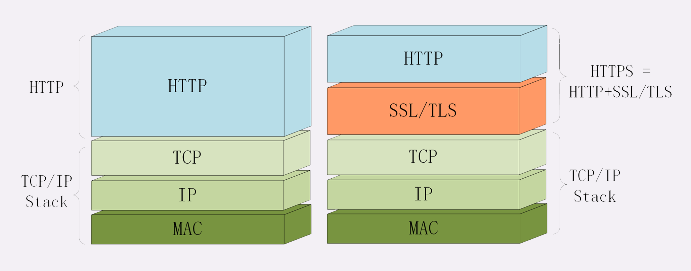
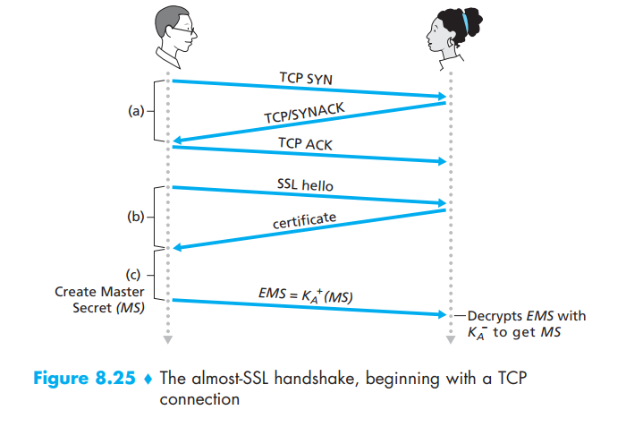

<!-- MarkdownTOC -->

- [Https](#https)
	- [Security - Confidentiality](#security---confidentiality)
		- [Symmetric encryption](#symmetric-encryption)
		- [Asymmetric encryption](#asymmetric-encryption)
		- [Combined encryption](#combined-encryption)
	- [Security - Integrity](#security---integrity)
	- [Security - Authentication and Non-repudiation](#security---authentication-and-non-repudiation)
		- [Digital signature](#digital-signature)
			- [Certificate](#certificate)
				- [Concepts](#concepts)
				- [Cons](#cons)
	- [Structure](#structure)
		- [SSL/TLS](#ssltls)
	- [Overall flowchart](#overall-flowchart)
		- [TLS protocol \(v1.2\)](#tls-protocol-v12)
			- [Components](#components)
			- [TLS Handshake based on RSA](#tls-handshake-based-on-rsa)
			- [TLS Handshake based on ECDHE](#tls-handshake-based-on-ecdhe)
		- [TLS protocol \(v1.3\)](#tls-protocol-v13)
			- [Compatibility](#compatibility)
		- [HTTPS performance optimization](#https-performance-optimization)
		- [Almost handshake](#almost-handshake)
		- [Early termination](#early-termination)

<!-- /MarkdownTOC -->


# Https

## Security - Confidentiality
* Guaranteed by AES

### Symmetric encryption
* RC4, DES, 3DES, AES, ChaCha20
* 加密分组模式：用固定长度的秘钥加密任意长度的密文，把小秘密转化为大秘密
	- ECB, CBC, CFB, OFB, GCM
* Cons:
	- Does not have a reliable way to transfer cipher key


### Asymmetric encryption
* DH, DSA, RSA, ECC
* RSA: 基于证书分解的数学难题，使用两个超大素数的乘积作为生成秘钥的材料
* ECC: 基于椭圆曲线离散对数
	- Widely used elliptic curve: P-256 / x25519
	- P-256 is the curve recommended by NIST/NSA
	- 下5519 is the most secure 


### Combined encryption
* First use RSA/ECDHE to solve the problem of exchanging private key
* Generate session key used for symmetric key
* Speed comparison for symmetric asymetric

```
aes_128_cbc enc/dec 1000 times : 0.97ms, 13.11MB/s

rsa_1024 enc/dec 1000 times : 138.59ms, 93.80KB/s
rsa_1024/aes ratio = 143.17

rsa_2048 enc/dec 1000 times : 840.35ms, 15.47KB/s
rsa_2048/aes ratio = 868.13
```

## Security - Integrity
* Digest algorithm
* MD5, SHA1-> SHA2 (SHA224、SHA256、SHA384，分别能够生成 28 字节、32 字节、48 字节的摘要)
* HMAC:


## Security - Authentication and Non-repudiation

### Digital signature
*  Reverse the usage of private and public key inside asymmetric encryption
* Private key only encrypts the digest of message

#### Certificate


##### Concepts
* Certificate authority
* Certificate issuer: DigiCert, VeriSign, Entrust, Let's Encrypt
* Types of certificates: 
	- DV
	- EV
* Root CA needs to have a self-signed certificate / root certificate.


##### Cons
* What if CA gets tricked to issue certificate to the wrong person
	- CRL (certificate revocation list)
	- OCSP (online certificate status protocol)
* CA itself get hacked
* RSA asymmetric 


## Structure




### SSL/TLS 
* Secure Sockets Layer / Transport layer security
* Fifth layer. Netscape 1994. V2/V3
* Versions:
	* SSLv1/v2
	* SSLv3.1 => TLS1.0
	* TLS1.0/1.1、SSLv3/v2 all considered to be unsecure
* Most widely used: TLS 1.2
* SSL/TLS could also be applied to other applications 
	* FTP => FTPS
	* LDAP => LDAPS

## Overall flowchart
* Flow chart


* TLS Cipher suite
	- 秘钥交换算法-签名算法-对称加密算法-摘要算法
	- ECDHE-RSA-AES256-GCM-SHA384
* Many softwares such as Nginx/Apache use OpenSSL to implement TLS

### TLS protocol (v1.2)
#### Components
* Record protocol
	- Defines the basic unit for data transfer
* Alert protocol
	- Send an alerting message to the other party
* Change cipher spec protocol 
	- States that all following conversations will be conducted in encrypted version
* Handshake protocol
	- See the next section for details

#### TLS Handshake based on RSA


#### TLS Handshake based on ECDHE
* Optimization on top of handshake based on RSA:
	- Since it is using ECDHE for exchange key instead of RSA, server side will send out "Server key exchange"
	- TLS False Start: Client could send out request without waiting for server to reply with "Finished"
	- Will generate a new public/private key each time having a handshake. So even when one time's pre-master get deciphered, all previous conversation could stay safe. 
* "Hello" exchange random number, "Key exchange" exchange "pre-master".
* Before "Change Cipher Spec", all plaintext; After all ciphertext.
* Pre-Master must be transmitted in secret. 

0. TCP handshake first

1. Client Hello
	- TLS version 
	- Client random 
	- Cipher suites (e.g. ECDHE_RSA)

```
Handshake Protocol: Client Hello
    Version: TLS 1.2 (0x0303)
    Random: 1cbf803321fd2623408dfe…
    Cipher Suites (17 suites)
        Cipher Suite: TLS_ECDHE_RSA_WITH_AES_128_GCM_SHA256 (0xc02f)
        Cipher Suite: TLS_ECDHE_RSA_WITH_AES_256_GCM_SHA384 (0xc030)
```

2. Server Hello: 
	- TLS version
	- Server random
	- Cipher suites

```
Handshake Protocol: Server Hello
    Version: TLS 1.2 (0x0303)
    Random: 0e6320f21bae50842e96…
    Cipher Suite: TLS_ECDHE_RSA_WITH_AES_256_GCM_SHA384 (0xc030)
```

3. Server key exchange: 
	- Server params

```
Handshake Protocol: Server Key Exchange
    EC Diffie-Hellman Server Params
        Curve Type: named_curve (0x03)
        Named Curve: x25519 (0x001d)
        Pubkey: 3b39deaf00217894e...
        Signature Algorithm: rsa_pkcs1_sha512 (0x0601)
        Signature: 37141adac38ea4...
```

4. Client key exchange
	- Client params

```
Handshake Protocol: Client Key Exchange
    EC Diffie-Hellman Client Params
        Pubkey: 8c674d0e08dc27b5eaa…
```

5. Now the Client has Client Params, Server Params, from which they will be able to compute PreMaster

6. Using Client Random, Server Random and PreMaster, client and server will compute Master Secret. 

7. Client sends Change cipher spec.

8. Client sends Finished.

9. Server sends Change cipher spec. 

10. Server sends Finished. 


### TLS protocol (v1.3)

#### Compatibility


### HTTPS performance optimization
* Hardware optimization
* Software optimization
* Secret key exchange
	- Adopt TLS 1.3 because it only needs 1-RTT
	- If you could only use 1.2, then use ECDHE algorithm for key exchange
		- x25519 
		- P-256
* Certificate transmission
	- Choose ECDSA certificate instead of RSA certificate because it is much smaller.
* Certificate verification
	- Replace CRL with OCP
	- Replace OCP with OCSP Stapling
* TLS session resumption
	- Session ID
	- Session Ticket
* Pre-shared key
	- 


### Almost handshake


### Early termination


