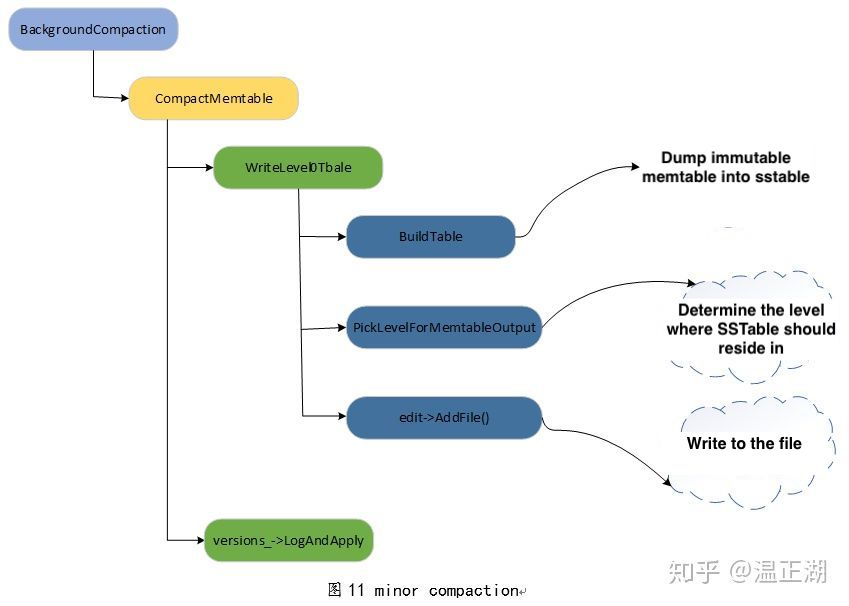
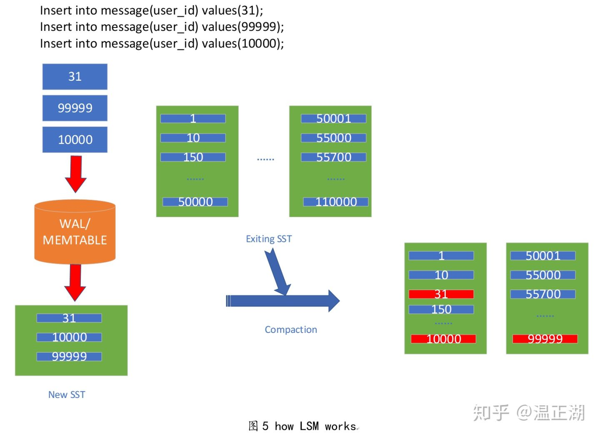
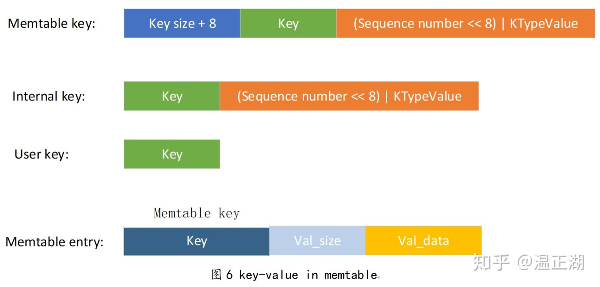
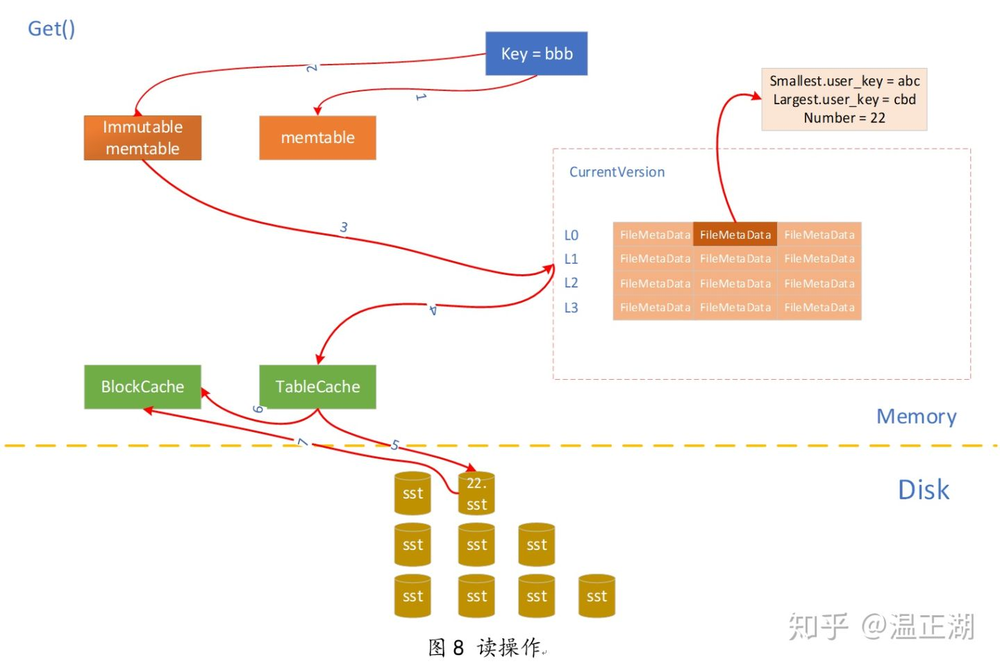
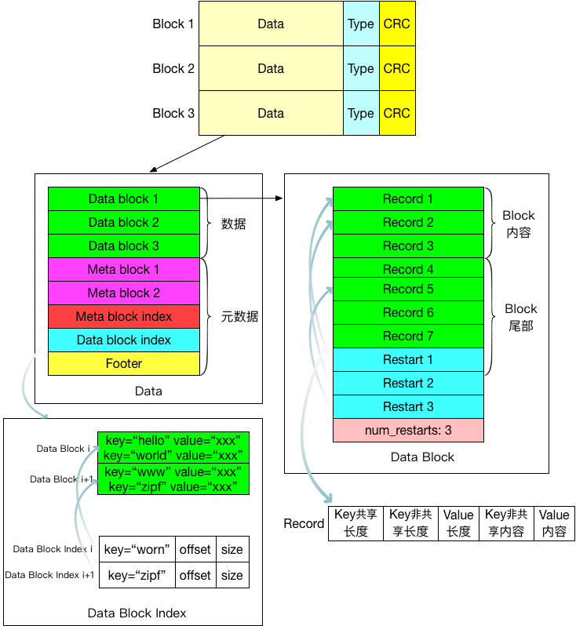
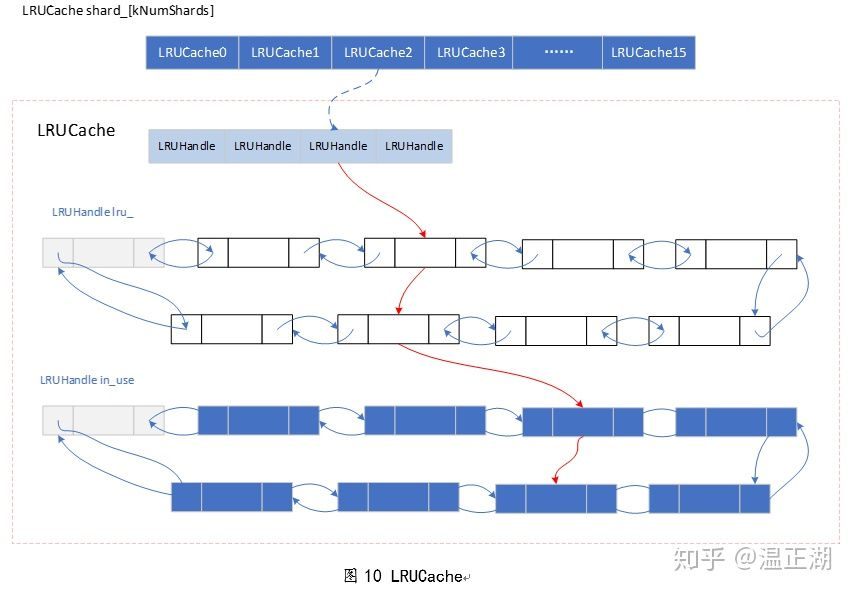
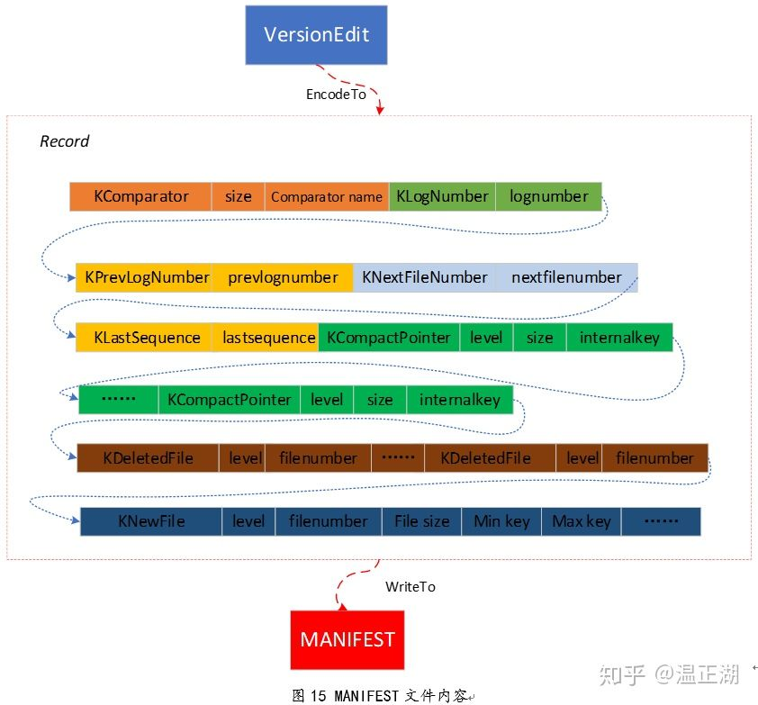

<!-- MarkdownTOC -->

- [Amazon Dynamo](#amazon-dynamo)
	- [Data distribution - consistent hashing](#data-distribution---consistent-hashing)
	- [Replication protocol - Replicated write protocol](#replication-protocol---replicated-write-protocol)
	- [Data consistency - Vector clock](#data-consistency---vector-clock)
	- [Temporary failure - hinted handoff](#temporary-failure---hinted-handoff)
	- [permanent failure - merkle tree](#permanent-failure---merkle-tree)
	- [Membership and failure detection - gossip protocol](#membership-and-failure-detection---gossip-protocol)
- [LevelDB](#leveldb)
	- [Architecture](#architecture)
		- [Memory](#memory)
		- [Storage](#storage)
			- [SSTable \(Sorted String Table\)](#sstable-sorted-string-table)
			- [Write ahead log](#write-ahead-log)
		- [Compact thread](#compact-thread)
			- [Conditions for compaction](#conditions-for-compaction)
			- [Minor compaction](#minor-compaction)
			- [Major compaction](#major-compaction)
	- [Write process](#write-process)
		- [Downsides of B+ tree](#downsides-of-b-tree)
		- [LSM tree](#lsm-tree)
		- [LSM tree write process](#lsm-tree-write-process)
		- [Memtable format](#memtable-format)
	- [Read process](#read-process)
		- [SStable format](#sstable-format)
	- [Cache](#cache)
	- [MVCC](#mvcc)
		- [Recover process](#recover-process)
		- [Repair process](#repair-process)
- [Big table](#big-table)
		- [Features](#features)
		- [Services](#services)
		- [Storage](#storage-1)
			- [Initial design](#initial-design)
			- [Balance read/write complexity](#balance-readwrite-complexity)
			- [Store the Nth table/file in memory](#store-the-nth-tablefile-in-memory)
			- [Save disk space](#save-disk-space)
			- [Optimize read](#optimize-read)
				- [Optimize read with index](#optimize-read-with-index)
				- [Optimize read with Bloom filter](#optimize-read-with-bloom-filter)
			- [Standalone final solution](#standalone-final-solution)
				- [Terminologies](#terminologies)
				- [Read process](#read-process-1)
				- [Write process](#write-process-1)
		- [Scale](#scale)
			- [Master slave model](#master-slave-model)
				- [Read process](#read-process-2)
				- [Write process](#write-process-2)
			- [Too much data to store on slave local disk](#too-much-data-to-store-on-slave-local-disk)
				- [Read/Write process](#readwrite-process)
			- [Race condition](#race-condition)
				- [Read process](#read-process-3)
				- [Write process](#write-process-3)
- [Reference:](#reference)

<!-- /MarkdownTOC -->

# Amazon Dynamo
## Data distribution - consistent hashing
* Data distributed in multiDC: https://www.onsip.com/voip-resources/voip-fundamentals/intro-to-cassandra-and-networktopologystrategy
* Consistent hashing in Cassandra documentation: https://cassandra.apache.org/doc/latest/architecture/dynamo.html

## Replication protocol - Replicated write protocol
## Data consistency - Vector clock
## Node repair
* https://docs.datastax.com/en/ddac/doc/datastax_enterprise/dbArch/archAboutRepair.html

### Write path
* https://cassandra.apache.org/doc/latest/operating/hints.html
* https://docs.scylladb.com/architecture/anti-entropy/hinted-handoff/

### Read path
* https://docs.datastax.com/en/ddac/doc/datastax_enterprise/dbArch/archAboutRepair.html

### Anti-Entropy

## Membership and failure detection - gossip protocol
### Motivation
* https://www.coursera.org/lecture/cloud-computing/1-1-multicast-problem-G75ld
* https://www.coursera.org/lecture/cloud-computing/1-2-the-gossip-protocol-5AOex

### Gossip Internals
* Gossip protocol data structure https://medium.com/@swarnimsinghal/implementing-cassandras-gossip-protocol-part-1-b9fd161e5f49

### Disemination protocols
* https://www.coursera.org/lecture/cloud-computing/2-6-dissemination-and-suspicion-OQF73

## Read repair
* https://docs.scylladb.com/architecture/anti-entropy/read-repair/

## Others
* Incremental repair: https://www.datastax.com/blog/2014/02/more-efficient-repairs-21
* Advanced repair: https://www.datastax.com/blog/2013/07/advanced-repair-techniques

# LevelDB
## Architecture

### Memory

### Storage
#### SSTable (Sorted String Table)
#### Write ahead log
* log format
	- WAL log
	- block
	- record

* log record payload
	- writebatch
	- put_op
	- delete_op

### Compact thread
#### Compare between different compaction strategy
* https://docs.scylladb.com/architecture/compaction/compaction-strategies/

#### Conditions for compaction

#### Minor compaction
1. turn immutable memtable dump into sstable

2. Determine the level of sstable

#### Major compaction

## Write process

### Downsides of B+ tree

### LSM tree

### LSM tree write process
* Write steps:

### Memtable format

## Read process

### SStable format

## Cache

## MVCC

### Recover process

### Repair process

# Big table
### Features
* Read or write intensive
	- Whether to optimize read operations
* Large amounts of data
	- Whether needs sharding

### Services
* value get(Key)
* set(key, value)
	- Modify existing entry (key, value)
	- Create new entry (key, value)

### Storage
#### Initial design
* Sorted file with (Key, Value) entries
	- Disk-based binary search based read O(lgn)
	- Linear read operations write O(n)
* Unsorted file with (Key, Value) entries
	- Linear read operations O(n)
	- Constant time write O(1)

#### Balance read/write complexity
* Combine append-only write and binary search read
	- Break the large table into a list of smaller tables 0~N
		+ 0~N-1 th tables are all stored in disk in sorted order as File 0 ~ File N-1.
		+ Nth table is stored in disk unsorted as File N.
	- Have a in-memory table mapping mapping tables/files to its address.
* Write: O(1)
	- Write directly goes to the Nth table/file.
	- If the Nth table is full, sort it and write it to disk. And then create a new table/file.
* Read: O(n)
	- Linearly scan through the Nth table.  
	- If cannot find, perform binary search on N-1, N-2, ..., 0th. 

#### Store the Nth table/file in memory
* Disk-based approach vs in-memory approach
	- Disk-based approach: All data Once disk reading + disk writing + in-memory sorting
	- In-memory approach: All data Once disk writing + in-memory sorting
* What if memory is lost?
	- Problem: Nth in memory table is lost. 
	- Write ahead log / WAL: The WAL is the lifeline that is needed when disaster strikes. Similar to a BIN log in MySQL it records all changes to the data. This is important in case something happens to the primary storage. So if the server crashes it can effectively replay that log to get everything up to where the server should have been just before the crash. It also means that if writing the record to the WAL fails the whole operation must be considered a failure. Have a balance between between latency and durability.

#### Save disk space
* Consume too much disk space due to repetitive entries (Key, Value)
	- Have a background process doing K-way merge for the sorted tables regularly

#### Optimize read
##### Optimize read with index
* Each sorted table should have an index inside memory. 
	- The index is a sketch of key value pairs
* More advanced way to build index with B tree. 

##### Optimize read with Bloom filter
* Each sorted table should have a bloomfilter inside memory. 
* Accuracy of bloom filter
	- Number of hash functions
	- Length of bit vector
	- Number of stored entries

#### Standalone final solution
##### Terminologies
* In-memory table: In-memory skip list
* 1~N-1th disk-based tables: Sstable
* Tablet server: Slave server

##### Read process
1. First check the Key inside in-memory skip list.
2. Check the bloom filter for each file and decide which file might have this key.
3. Use the index to find the value for the key.
4. Read and return key, value pair.

##### Write process
1. Record the write operation inside write ahead log.
2. Write directly goes to the in-memory skip list.
3. If the in-memory skip list reaches its maximum capacity, sort it and write it to disk as a Sstable. At the same time create index and bloom filter for it.
4. Then create a new table/file.

### Scale
#### Master slave model
* Master has the hashmap [Key, server address]
* Slave is responsible for storing data

##### Read process
1. Client sends request of reading Key K to master server. 
2. Master returns the server index by checking its consistent hashmap.
3. Client sends request of Key to slave server. 
	1. First check the Key pair inside memory.
	2. Check the bloom filter for each file and decide which file might have this key.
	3. Use the index to find the value for the key. 
	4. Read and return key, value pair

##### Write process
1. Clients send request of writing pair K,V to master server.
2. Master returns the server index
3. Clients send request of writing pair K,V to slave server. 
	1. Slave records the write operation inside write ahead log.
	2. Slave writes directly go to the in-memory skip list.
	3. If the in-memory skip list reaches its maximum capacity, sort it and write it to disk as a Sstable. At the same time create index and bloom filter for it.
	4. Then create a new table/file.

#### Too much data to store on slave local disk
* Replace local disk with GFS for
	- Disk size
	- Replica 
	- Failure and recovery
* Write ahead log and SsTable are all stored inside GFS.
	- How to write SsTable to GFS
		+ Divide SsTable into multiple chunks (64MB) and store each chunk inside GFS.

##### Read/Write process
* GFS is added as an additional layer

#### Race condition
* Master server also has a distributed lock (such as Chubby/Zookeeper)
* Distributed lock 
	- Consistent hashmap is stored inside the lock server

##### Read process
1. Client sends request of reading Key K to master server. 
2. Master server locks the key. Returns the server index by checking its consistent hashmap.
3. Client sends request of Key to slave server. 
	1. First check the Key pair inside memory.
	2. Check the bloom filter for each file and decide which file might have this key.
	3. Use the index to find the value for the key. 
	4. Read and return key, value pair
4. Read process finishes. Slave notifies the client. 
5. The client notifies the master server to unlock the key. 

##### Write process
1. Clients send request of writing pair K,V to master server.
2. Master server locks the key. Returns the server index. 
3. Clients send request of writing pair K,V to slave server. 
	1. Slave records the write operation inside write ahead log.
	2. Slave writes directly go to the in-memory skip list.
	3. If the in-memory skip list reaches its maximum capacity, sort it and write it to disk as a Sstable. At the same time create index and bloom filter for it.
	4. Then create a new table/file.
4. Write process finishes. Slave notifies the client.
5. The client notifies the master server to unlock the key. 

# Reference: 
1. using level DB and Rocks DB as an example - https://soulmachine.gitbooks.io/system-design/content/cn/key-value-store.html
2. Meituan build on top of tair and redis - https://tech.meituan.com/2020/07/01/kv-squirrel-cellar.html
3. Series of blog on key value store - http://codecapsule.com/2012/11/07/ikvs-implementing-a-key-value-store-table-of-contents/
4. MIT spring 2018. Final course on KV store - http://nil.csail.mit.edu/6.824/2018/projects.html
5. Raft-based implementation 极客时间：https://time.geekbang.org/column/article/217049
6. Taobao tair: https://time.geekbang.org/column/article/217049
7. LevelDB: 
  * Basic: https://zhuanlan.zhihu.com/p/51358869
  * Read write process: https://zhuanlan.zhihu.com/p/51360281
  * Cache mechanism: https://zhuanlan.zhihu.com/p/51573464
  * Compaction design: https://zhuanlan.zhihu.com/p/51573929
  * MVCC: https://zhuanlan.zhihu.com/p/51858206
  * https://soulmachine.gitbooks.io/system-design/content/cn/key-value-store.html
  * https://zhuanlan.zhihu.com/p/80684560
  * https://developer.aliyun.com/article/618109
8. Disk IO
  * https://medium.com/databasss/on-disk-io-part-1-flavours-of-io-8e1ace1de017
