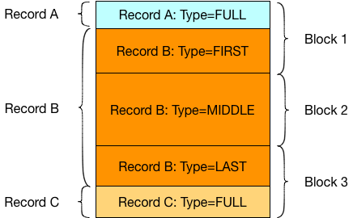
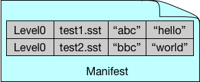

<!-- MarkdownTOC -->

- [LevelDB](#leveldb)
	- [Architecture](#architecture)
		- [Memory](#memory)
		- [Storage](#storage)
			- [Write ahead log](#write-ahead-log)
		- [Compact thread](#compact-thread)
			- [Conditions for compaction](#conditions-for-compaction)
			- [Minor compaction](#minor-compaction)
			- [Major compaction](#major-compaction)
	- [Write process](#write-process)
		- [Downsides of B+ tree](#downsides-of-b-tree)
		- [LSM tree](#lsm-tree)
		- [LSM tree write process](#lsm-tree-write-process)
		- [Memtable format](#memtable-format)
	- [Read process](#read-process)
		- [SStable format](#sstable-format)
	- [Cache](#cache)
	- [MVCC](#mvcc)
		- [Recover process](#recover-process)
		- [Repair process](#repair-process)
- [Reference:](#reference)

<!-- /MarkdownTOC -->

# LevelDB
## Architecture

### Memory

### Storage

#### Write ahead log
* log format
	- WAL log
	- block
	- record

* log record payload
	- writebatch
	- put_op
	- delete_op

### Compact thread
#### Conditions for compaction

#### Minor compaction
1. turn immutable memtable dump into sstable

2. Determine the level of sstable

#### Major compaction

## Write process

### Downsides of B+ tree

### LSM tree

### LSM tree write process
* Write steps:

### Memtable format

## Read process

### SStable format

## Cache

## MVCC

### Recover process

### Repair process

# Reference: 
1. using level DB and Rocks DB as an example - https://soulmachine.gitbooks.io/system-design/content/cn/key-value-store.html
2. Meituan build on top of tair and redis - https://tech.meituan.com/2020/07/01/kv-squirrel-cellar.html
3. Series of blog on key value store - http://codecapsule.com/2012/11/07/ikvs-implementing-a-key-value-store-table-of-contents/
4. MIT spring 2018. Final course on KV store - http://nil.csail.mit.edu/6.824/2018/projects.html
5. Raft-based implementation 极客时间：https://time.geekbang.org/column/article/217049
6. Taobao tair: https://time.geekbang.org/column/article/217049
