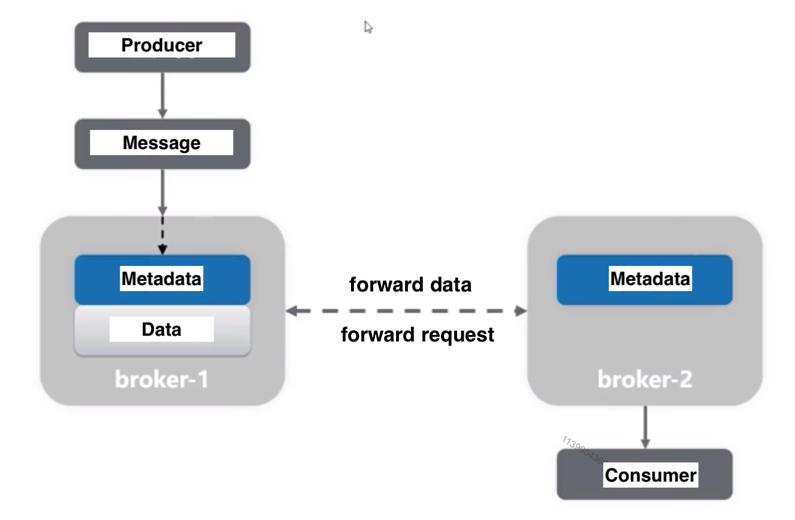
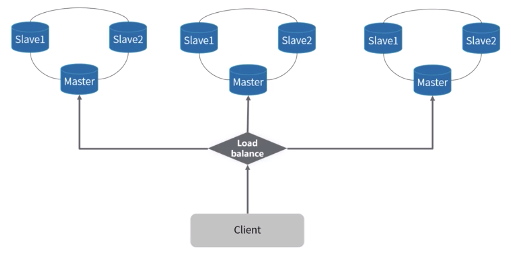
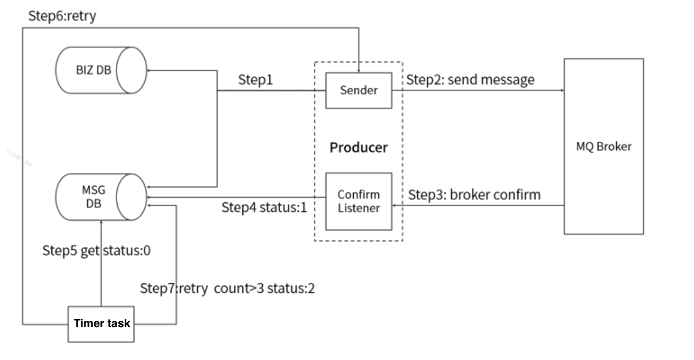
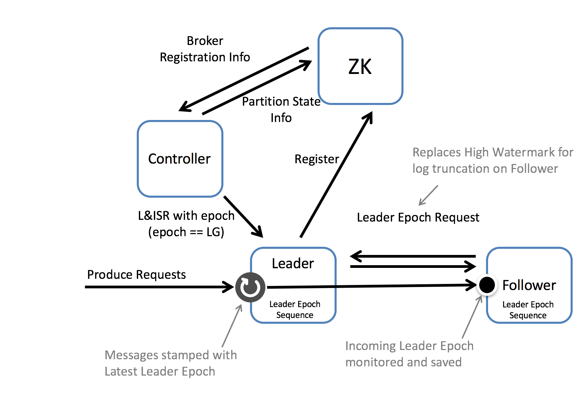
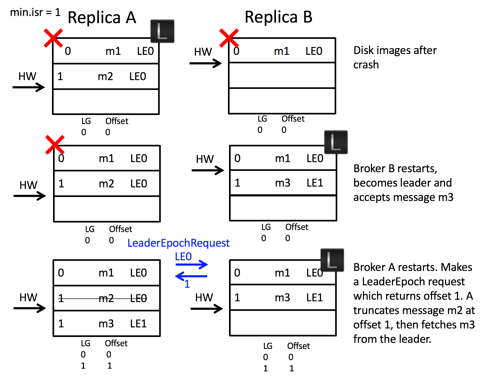
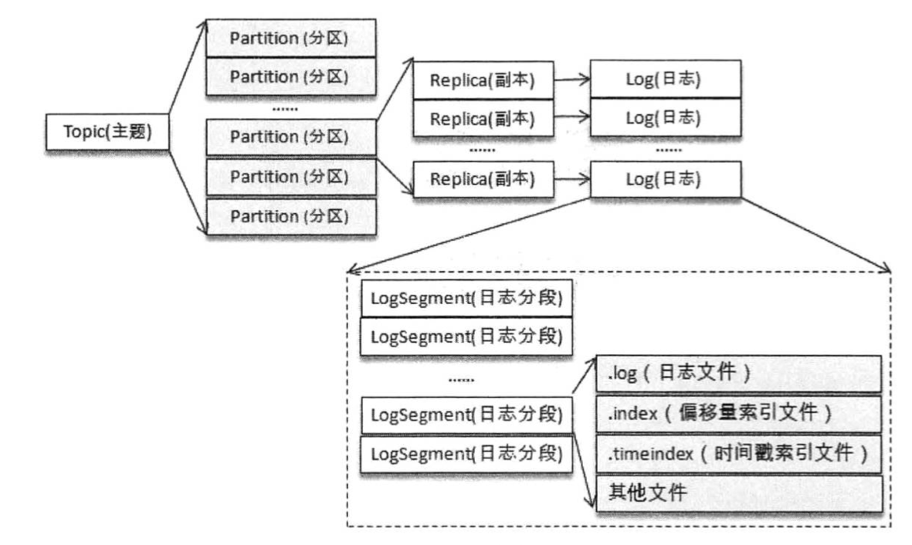
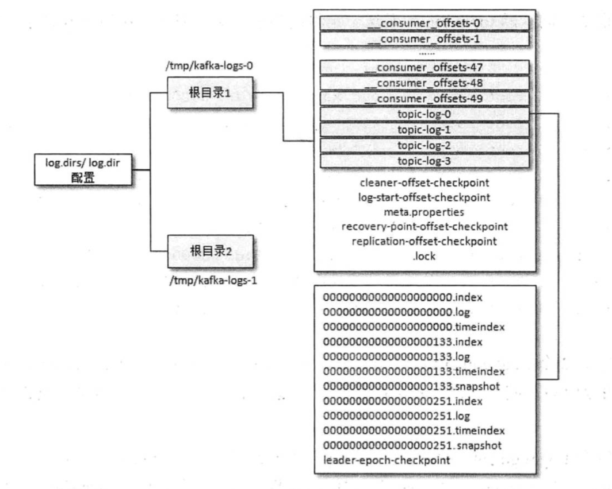
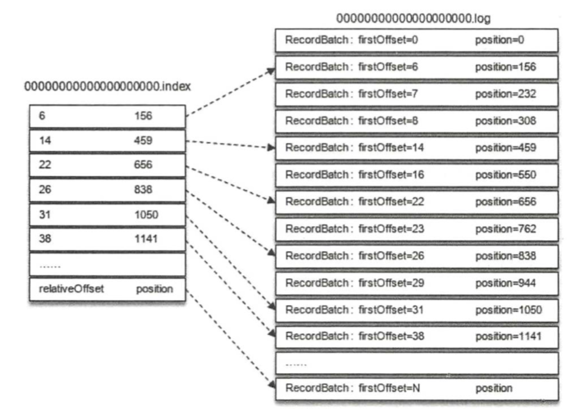
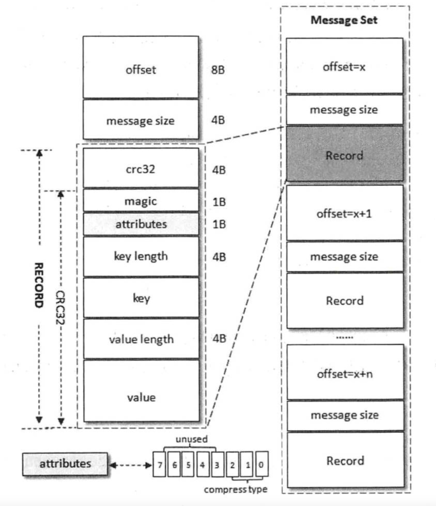
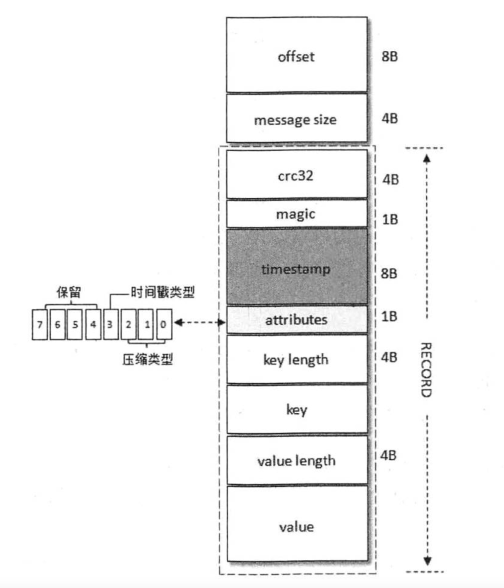

<!-- MarkdownTOC -->

- [Message queue](#message-queue)
	- [Protocols](#protocols)
		- [Why not http protocol](#why-not-http-protocol)
		- [Openwire](#openwire)
		- [AMQP](#amqp)
		- [MQTT](#mqtt)
		- [Kafka](#kafka)
		- [OpenMessaging](#openmessaging)
	- [Persistent mechanisms](#persistent-mechanisms)
	- [Message distribution](#message-distribution)
	- [High availability](#high-availability)
		- [Single master broker and multi slave brokers](#single-master-broker-and-multi-slave-brokers)
			- [Cold backup](#cold-backup)
			- [Read-Write separation](#read-write-separation)
		- [Multi master broker](#multi-master-broker)
			- [Full data replication](#full-data-replication)
			- [Metadata replication and forward](#metadata-replication-and-forward)
		- [Multi master broker with slaves](#multi-master-broker-with-slaves)
	- [High reliable](#high-reliable)
		- [Message transmission reliability](#message-transmission-reliability)
		- [Message storage reliability](#message-storage-reliability)
	- [Applicable scenarios](#applicable-scenarios)
	- [Components](#components)
	- [Metrics to decide which message broker to use](#metrics-to-decide-which-message-broker-to-use)
	- [Challenges](#challenges)
- [ActiveMQ](#activemq)
	- [JMS](#jms)
	- [Persistence](#persistence)
	- [Transaction support](#transaction-support)
	- [Supported protocols](#supported-protocols)
	- [High availability](#high-availability-1)
- [RabbitMQ](#rabbitmq)
	- [Concepts](#concepts)
	- [Persistence](#persistence-1)
		- [Memory control](#memory-control)
	- [High availability](#high-availability-2)
	- [Reliability](#reliability)
		- [Send reliability](#send-reliability)
		- [Storage reliability](#storage-reliability)
		- [Consumption](#consumption)
- [Kafka](#kafka-1)
	- [Use cases](#use-cases)
		- [Message broker](#message-broker)
			- [Comparison with other msg brokers](#comparison-with-other-msg-brokers)
		- [Stream processing](#stream-processing)
		- [Storage](#storage)
	- [Design priniples](#design-priniples)
		- [High IO throughput](#high-io-throughput)
			- [Sequential read and pageCache](#sequential-read-and-pagecache)
			- [ZeroCopy](#zerocopy)
			- [Batching](#batching)
		- [The producer](#the-producer)
			- [Load balancing](#load-balancing)
			- [Compression](#compression)
			- [Push-based produer](#push-based-produer)
		- [The consumer](#the-consumer)
			- [Pull-based consumer](#pull-based-consumer)
			- [Consumer position](#consumer-position)
		- [Message delivery semantics](#message-delivery-semantics)
			- [Message delivery](#message-delivery)
			- [At least once delivery](#at-least-once-delivery)
			- [At most once delivery](#at-most-once-delivery)
			- [Exactly once delivery](#exactly-once-delivery)
		- [In-sync Replica](#in-sync-replica)
			- [Consistency model](#consistency-model)
			- [Availability model](#availability-model)
			- [High watermark / Log end offset](#high-watermark--log-end-offset)
				- [Definition](#definition)
			- [When to update high watermark](#when-to-update-high-watermark)
			- [When to update log end offset](#when-to-update-log-end-offset)
			- [Leader epoch](#leader-epoch)
				- [Existing flaws in replica protocol](#existing-flaws-in-replica-protocol)
				- [Epoch concept](#epoch-concept)
				- [Epoch in data lose scenario](#epoch-in-data-lose-scenario)
				- [Epoch in data diverge scenario](#epoch-in-data-diverge-scenario)
			- [Unclean leader election](#unclean-leader-election)
	- [Broker](#broker)
	- [Controller](#controller)
	- [Producer](#producer)
	- [Consumer](#consumer)
	- [Storage layer](#storage-layer)
		- [File structure](#file-structure)
		- [Index](#index)
			- [.index](#index-1)
			- [.timeindex](#timeindex)
		- [Evolution of message format](#evolution-of-message-format)
			- [V0 message format](#v0-message-format)
			- [V1 message format](#v1-message-format)
			- [V2](#v2)
		- [Log cleaning](#log-cleaning)
			- [Log retention](#log-retention)
			- [Log compaction](#log-compaction)
	- [Stream processing](#stream-processing-1)
- [RocketMQ](#rocketmq)
	- [Definition](#definition-1)
	- [Time series data](#time-series-data)
	- [Storage model](#storage-model)

<!-- /MarkdownTOC -->

# Message queue 
## Protocols 
### Why not http protocol
* Too complicated. Large transmission overhead
	- Headers, status code ......
* Most cases short-lived connection
	- Message queue client could wait long for a message queue. 

### Openwire

### AMQP
* Proposed by JPMorgan Chase
* Pros: Transaction support. Persistent support.
* Both RabbitMQ and ActiveMQ implements AMQP

### MQTT
* Pros: Lightweight, fast transmission, simple structure
* Cons: No support for persistent or transaction

### Kafka
* Binary protocol based on TCP. 
* Pros: Lightweight, simple structure support 
* Cons:  no support for transaction,

### OpenMessaging
* Built by Yahoo, Didi, Streamlio
* Pros: Lightweight, fast transmission, simple structure, support transaction and persistence. 
* Implemented by RocketMQ

## Persistent mechanisms

|  Message Queues | ActiveMQ  |  RabbitMQ | RocketMQ  |  Kafka |
|---|---|---|---|---|
| file system   | support  |  support | support  | support  |
| database  | support  | No  |  No  |  No  |

## Message distribution
* How will consumer receive message
	- Pub-Sub: Message server will push messages to clients.
	- Consumer Pull: Clients will pull messages from message server.
* How will message be distributed among multiple consumers:
	- Round robin fashion based distribution
	- Weighted fashion based distribution
* Does message server support resend

|                           | ActiveMQ  | RabbitMQ  |  Kafka  |  RocketMQ  |
|---------------------------|-----------|-----------|---------|------------|
|          Pub-Sub          |   Support |  Support  | Support |   Support  |
|       Consumer pull       |     No    |  Support  | Support |   Support  |
|  Round robin distribute   |   Support |  Support  | Support |     No     |
|      Weighted distribute  |     No    |  Support  | Support |     No     |
|            Resend         |   Support |  Support  |   No    |   Support  |

## High availability
### Single master broker and multi slave brokers
#### Cold backup
* All master/slave read data from message storage but only master is serving traffic


#### Read-Write separation
* All master/slave read data from message storage but master could serve write traffic and slave could serve read traffic


### Multi master broker
#### Full data replication
* Full dataset is shared by replication among multiple brokers and each broker could serve read/write traffic


#### Metadata replication and forward
* Data is sharded among multiple brokers and only metadata is shared by replication
	- The request could be forwarded to the correct broker



### Multi master broker with slaves



## High reliable
* Definition: System could function without errors or corruption

### Message transmission reliability
* Broker could successfully receive the message from producer
* Consumer could successfully receive the message from broker

### Message storage reliability

## Applicable scenarios 
* **Enabling asynchronous processing**: 
	- Defer processing of time-consuming tasks without blocking our clients. Anything that is slow or unpredictable is a candidate for asynchronous processing. Example include
		+ Interact with remote servers
		+ Low-value processing in the critical path
		+ Resource intensive work
		+ Independent processing of high- and low- priority jobs
	- Message queues enable your application to operate in an asynchronous way, but it only adds value if your application is not built in an asynchronous way to begin with. If you developed in an environment like Node.js, which is built with asynchronous processing at its core, you will not benefit from a message broker that much. What is good about message brokers is that they allow you to easily introduce asynchronous processing to other platforms, like those that are synchronous by nature (C, Java, Ruby)
* **Easier scalability**: 
	- Producers and consumers can be scaled separately. We can add more producers at any time without overloading the system. Messages that cannot be consumed fast enough will just begin to line up in the message queue. We can also scale consumers separately, as now they can be hosted on separate machines and the number of consumers can grow independently of producers.
* **Decoupling**: 
	- All that publishers need to know is the format of the message and where to publish it. Consumers can become oblivious as to who publishes messages and why. Consumers can focus solely on processing messages from the queue. Such a high level decoupling enables consumers and producers to be developed indepdently. They can even be developed by different teams using different technologies. 
* **Evening out traffic spikes**:
	- You should be able to keep accepting requests at high rates even at times of increased traffic. Even if your publishing generates messages much faster than consumers can keep up with, you can keep enqueueing messages, and publishers do not have to be affected by a temporary capacity problem on the consumer side.
* **Isolating failures and self-healing**:
	- The fact that consumers' availability does not affect producers allows us to stop message processing at any time. This means that we can perform maintainance and deployments on back-end servers at any time. We can simply restart, remove, or add servers without affecting producer's availability, which simplifies deployments and server management. Instead of breaking the entire application whenever a back-end server goes offline, all that we experience is reduced throughput, but there is no reduction of availability. Reduced throughput of asynchronous tasks is usually invisible to the user, so there is no consumer impact. 

## Components 
* Message producer 
	- Locate the message queue and send a valid message to it
* Message broker - where messages are sent and buffered for consumers. 
	- Be available at all times for producers and to accept their messages. 
	- Buffering messages and allowing consumers to consume related messages.
* Message consumer
	- Receive and process message from the message queue. 
	- The two most common ways of implement consumers are a "cron-like" and a "daemon-like" approach. 
		+ Connects periodically to the queue and checks the status of the queue. If there are messages, it consumes them and stops when the queue is empty or after consuming a certain amount of messages. This model is common in scripting languages where you do not have a persistenly running application container, such as PHP, Ruby, or Perl. Cron-like is also referred to as a pull model because the consumers pulls messages from the queue. It can also be used if messages are added to the queue rarely or if network connectivity is unreliable. For example, a mobile application may try to pull the queue from time to time, assuming that connection may be lost at any point in time.
		+ A daemon-like consumer runs constantly in an infinite loop, and it usually has a permanent connection to the message broker. Instead of checking the status of the queue periodically, it simply blocks on the socket read operation. This means that the consumer is waiting idly until messages are pushed by the message broker in the connection. This model is more common in languages with persistent application containers, such as Java, C#, and Node.js. This is also referred to as a push model because messages are pushed by the message broker onto the consumer as fast as the consumer can keep processing them. 

## Metrics to decide which message broker to use 
* Number of messages published per second
* Average message size
* Number of messages consumed per second (this can be much higher than publishing rate, as multiple consumers may be subscribed to receive copies of the same message)
* Number of concurrent publishers
* Number of concurrent consumers
* If message persistence is needed (no message loss during message broker crash)
* If message acknowledgement is need (no message loss during consumer crash)

## Challenges 
* No message ordering: Messages are processed in parallel and there is no synchronization between consumers. Each consumer works on a single message at a time and has no knowledge of other consumers running in parallel to it. Since your consumers are running in parallel and any of them can become slow or even crash at any point in time, it is difficult to prevent messages from being occasionally delivered out of order. 
	- Solutions:
		+ Limit the number of consumers to a single thread per queue
		+ Build the system to assume that messages can arrive in random order
		+ Use a messaging broker that supports partial message ordering guarantee. 
	- It is best to depend on the message broker to deliver messages in the right order by using partial message guarantee (ActiveMQ) or topic partitioning (Kafka). If your broker does not support such functionality, you will need to ensure that your application can handle messages being processed in an unpredictable order.
		+ Partial message ordering is a clever mechanism provided by ActiveMQ called message groups. Messages can be published with a special label called a message group ID. The group ID is defined by the application developer. Then all messages belonging to the same group are guaranteed to be consumed in the same order they were produced. Whenever a message with a new group ID gets published, the message broker maps the new group Id to one of the existing consumers. From then on, all the messages belonging to the same group are delivered to the same consumer. This may cause other consumers to wait idly without messages as the message broker routes messages based on the mapping rather than random distribution. 
	- Message ordering is a serious issue to consider when architecting a message-based application, and RabbitMQ, ActiveMQ and Amazon SQS messaging platform cannot guarantee global message ordering with parallel workers. In fact, Amazon SQS is known for unpredictable ordering messages because their infrastructure is heavily distributed and ordering of messages is not supported. 
* Message requeueing
	- By allowing messages to be delivered to your consumers more than once, you make your system more robust and reduce constraints put on the message queue and its workers. For this approach to work, you need to make all of your consumers idempotent. 
		+ But it is not an easy thing to do. Sending emails is, by nature, not an idempotent operation. Adding an extra layer of tracking and persistence could help, but it would add a lot of complexity and may not be able to handle all of the faiulres. 
		+ Idempotent consumers may be more sensitive to messages being processed out of order. If we have two messages, one to set the product's price to $55 and another one to set the price of the same product to $60, we could end up with different results based on their processing order. 
* Race conditions become more likely
* Risk of increased complexity
	- When integrating applications using a message broker, you must be very diligent in documenting dependencies and the overarching message flow. Without good documentation of the message routes and visibility of how the message flow through the system, you may increase the complexity and make it much harder for developers to understand how the system works. 

# ActiveMQ
## JMS
* Fully support JMS standard. JMS standards defined API client set will use. JMS defines the  following: 
	* Concept: Connection/Session/MessageProducer/MessageConsumer/Broker/Message
	* Message model: Point-to-Point, Pub/Sub
	* Message structure: Header, body

## Persistence
* Support JDBC, AMQ, KahaDB, LevelDB
	- JDBC: easy to manage but low performant
	- AMQ: File based storage mechanism. Performance better than JDBC
	- KahaDB: Default persistence storage
		+ Write batch size
		+ Cache size
		+ File size
	- LevelDB: KV storage

## Transaction support

## Supported protocols
* Supported protocols:
	* AUTO, OpenWire, AMQP, Stomp, MQTT
* Transmission mechanism
	* VM, TCP, SSL, UDP, Peer, Multicast, HTTPS
	* Failover, fanout, discovery, zeroConf

## High availability
* Shared storage master slave (file system/database/sharded database)
* Broker cluster

# RabbitMQ
## Concepts


## Persistence
* Queue persistence
* Message persistence
* Exchange persistence

### Memory control
* Max memory config

## High availability
* Metadata replication and forward
* Cluster mirrored queues
* Federation plugin
* Shovel plugin

## Reliability
### Send reliability
* Definition: Message could arrive at broker successfully
	* At most once: Supported. Usually not used because there might be message loss. 
	* At least once: Supported. There are two mechanism: Publisher confirm and transaction. The latter one is slow and seldomly used. 
	* Exactly once: Not supported
* Publisher confirm is a mechanism to return 



### Storage reliability

### Consumption 
* Storage reliability: Broker could persist the message and guarantee no loss
* Consumption reliability: Message could be successfully consumed


# Kafka
## Use cases
### Message broker
#### Comparison with other msg brokers
* Kafka 
	- Pros
		1. Integrate well with other components in big data processing and stream processing ecosystem
		2. Super high performance in async send/write. The extreme processing roughly 20 million msg / seconds
	- Cons
		1. A little low performance in sync send/write due to the batch upgrade inside. 
* RocketMQ
	- Pros
		1. Active community and plenty Chinese documentation
		2. Low performance latency
	- Cons
		1. Not so popular internationally. Less compatibility with the surrounding community
* RabbitMQ
	- Pros 
		1. Lightweight
		2. There is an exchange module between producer and queue which enables flexible routing.
	- Cons
		1. Written in Erlang, steep language learning curve.
		2. Relative low performance, 10K to 100K processed msg / second.
		3. Performance downgrade when large amounts of message accumulated and unprocessed.  
* ActiveMQ: Only choice 10 years ago
* ZeroMQ: Multi-threading network library
* Pulsar: Separation of storage and computation 

### Stream processing
* Many users of Kafka process data in processing pipelines consisting of multiple stages, where raw input data is consumed from Kafka topics and then aggregated, enriched, or otherwise transformed into new topics for further consumption or follow-up processing. For example, a processing pipeline for recommending news articles might crawl article content from RSS feeds and publish it to an "articles" topic; further processing might normalize or deduplicate this content and publish the cleansed article content to a new topic; a final processing stage might attempt to recommend this content to users. Such processing pipelines create graphs of real-time data flows based on the individual topics. Starting in 0.10.0.0, a light-weight but powerful stream processing library called Kafka Streams is available in Apache Kafka to perform such data processing as described above. Apart from Kafka Streams, alternative open source stream processing tools include Apache Storm and Apache Samza.

### Storage
* Traditional msg queues could not be used as storage because
	- Reading the msg also removes it
	- Messaging systems scale poorly as data accumulates beyond what fits in memory
	- Messaging systems generally lack robust replication features
* How Kafka is different from traditional msg queue
	- Kafka stores a persistent log which can be re-read and kept indefinitely
	- Kafka is built as a modern distributed system: it runs as a cluster, can expand or contract elastically, and replicates data internally for fault-tolerance and high-availability.
	- Kafka is built to allow real-time stream processing, not just processing of a single message at a time. This allows working with data streams at a much higher level of abstraction. 
* Whether Kafka could become a kind of universal database? No because
	- Databases are mostly about queries, Kafka does not benefit from any kind of random access against the log
	- The mission for Kafka is to make streams of data and stream processing a mainstream development paradihm. 
* Reference: [It's Okay to Store Data in Apache Kafka](https://www.confluent.io/blog/okay-store-data-apache-kafka/)

## Design priniples
### High IO throughput
#### Sequential read and pageCache
* Design: 
	- Each partition is stored sequentially on disk. Kafka storage is designed to be read / write sequentially. 
	- Rather than maintain as much as possible in-memory and flush it all out to the filesystem in a panic when we run out of space, we invert that. All data is immediately written to a persistent log on the filesystem without necessarily flushing to disk. In effect this just means that it is transferred into the kernel's pagecache.
* Reason: 
	- The key fact about disk performance is that the throughput of hard drives has been diverging from the latency of a disk seek for the last decade. As a result the performance of linear writes on a JBOD configuration with six 7200rpm SATA RAID-5 array is about 600MB/sec but the performance of random writes is only about 100k/sec—a difference of over 6000X. These linear reads and writes are the most predictable of all usage patterns, and are heavily optimized by the operating system. A modern operating system provides read-ahead and write-behind techniques that prefetch data in large block multiples and group smaller logical writes into large physical writes
	- To compensate for this performance divergence, modern operating systems have become increasingly aggressive in their use of main memory for disk caching. A modern OS will happily divert all free memory to disk caching with little performance penalty when the memory is reclaimed. All disk reads and writes will go through this unified cache. This feature cannot easily be turned off without using direct I/O, so even if a process maintains an in-process cache of the data, this data will likely be duplicated in OS pagecache, effectively storing everything twice.
	- Kafka is built on top of JVM: The memory overhead of objects is very high, often doubling the size of the data stored (or worse). Java garbage collection becomes increasingly fiddly and slow as the in-heap data increases. 
	- As a result of these factors using the filesystem and relying on pagecache is superior to maintaining an in-memory cache or other structure—we at least double the available cache by having automatic access to all free memory, and likely double again by storing a compact byte structure rather than individual objects. Doing so will result in a cache of up to 28-30GB on a 32GB machine without GC penalties. Furthermore, this cache will stay warm even if the service is restarted, whereas the in-process cache will need to be rebuilt in memory (which for a 10GB cache may take 10 minutes) or else it will need to start with a completely cold cache (which likely means terrible initial performance). This also greatly simplifies the code as all logic for maintaining coherency between the cache and filesystem is now in the OS, which tends to do so more efficiently and more correctly than one-off in-process attempts. If your disk usage favors linear reads then read-ahead is effectively pre-populating this cache with useful data on each disk read.

#### ZeroCopy
* At low message rates this is not an issue, but under load the impact is significant. To avoid this we employ a standardized binary message format that is shared by the producer, the broker, and the consumer (so data chunks can be transferred without modification between them).
* The message log maintained by the broker is itself just a directory of files, each populated by a sequence of message sets that have been written to disk in the same format used by the producer and consumer. Maintaining this common format allows optimization of the most important operation: network transfer of persistent log chunks.
* To understand the impact of sendfile, it is important to understand the common data path for transfer of data from file to socket:
	1. The operating system reads data from the disk into pagecache in kernel space
	2. The application reads the data from kernel space into a user-space buffer
	3. The application writes the data back into kernel space into a socket buffer
	4. The operating system copies the data from the socket buffer to the NIC buffer where it is sent over the network
* This is clearly inefficient, there are four copies and two system calls. Modern unix operating systems offer a highly optimized code path for transferring data out of pagecache to a socket; in Linux this is done with the sendfile system call. Using sendfile, this re-copying is avoided by allowing the OS to send the data from pagecache to the network directly. So in this optimized path, only the final copy to the NIC buffer is needed. 
* Using the zero-copy optimization above, data is copied into pagecache exactly once and reused on each consumption instead of being stored in memory and copied out to user-space every time it is read. This allows messages to be consumed at a rate that approaches the limit of the network connection.

#### Batching
* The small I/O problem happens both between the client and the server and in the server's own persistent operations.
* To avoid this, our protocol is built around a "message set" abstraction that naturally groups messages together. This allows network requests to group messages together and amortize the overhead of the network roundtrip rather than sending a single message at a time. The server in turn appends chunks of messages to its log in one go, and the consumer fetches large linear chunks at a time.
* This simple optimization produces orders of magnitude speed up. Batching leads to larger network packets, larger sequential disk operations, contiguous memory blocks, and so on, all of which allows Kafka to turn a bursty stream of random message writes into linear writes that flow to the consumers.

### The producer
#### Load balancing
* The producer controls which partition it publishes to. It sends data directly to the broker that is the leader for the partition without any intervening routing tier. 
	- Partition strategy
		* Round-robin
		* Randomized
		* Based on message key: or keyed This can be done at random, implementing a kind of random load balancing, or it can be done by some semantic partitioning function. 
		* Based on location: 
* To help the producer do this all Kafka nodes can answer a request for metadata about which servers are alive and where the leaders for the partitions of a topic are at any given time to allow the producer to appropriately direct its requests.

#### Compression
* In some cases the bottleneck is actually not CPU or disk but network bandwidth. This is particularly true for a data pipeline that needs to send messages between data centers over a wide-area network. Of course, the user can always compress its messages one at a time without any support needed from Kafka, but this can lead to very poor compression ratios as much of the redundancy is due to repetition between messages of the same type (e.g. field names in JSON or user agents in web logs or common string values). Efficient compression requires compressing multiple messages together rather than compressing each message individually.
* Kafka supports GZIP, Snappy, LZ4 and ZStandard compression protocols.
* Message will be compressed on producer, maintained on broker and decompressed on consumer. 

#### Push-based produer
* You could imagine other possible designs which would be only pull, end-to-end. The producer would locally write to a local log, and brokers would pull from that with consumers pulling from them. A similar type of "store-and-forward" producer is often proposed. This is intriguing but we felt not very suitable for our target use cases which have thousands of producers. Our experience running persistent data systems at scale led us to feel that involving thousands of disks in the system across many applications would not actually make things more reliable and would be a nightmare to operate. And in practice we have found that we can run a pipeline with strong SLAs at large scale without a need for producer persistence.

### The consumer
#### Pull-based consumer
* Pros:
	- A pull-based system has the nicer property that the consumer simply falls behind and catches up when it can. This can be mitigated with some kind of backoff protocol by which the consumer can indicate it is overwhelmed, but getting the rate of transfer to fully utilize (but never over-utilize) the consumer is trickier than it seems.
	- Another advantage of a pull-based system is that it lends itself to aggressive batching of data sent to the consumer. A push-based system must choose to either send a request immediately or accumulate more data and then send it later without knowledge of whether the downstream consumer will be able to immediately process it. If tuned for low latency, this will result in sending a single message at a time only for the transfer to end up being buffered anyway, which is wasteful. A pull-based design fixes this as the consumer always pulls all available messages after its current position in the log (or up to some configurable max size). So one gets optimal batching without introducing unnecessary latency.
* Cons: 
	- The deficiency of a naive pull-based system is that if the broker has no data the consumer may end up polling in a tight loop, effectively busy-waiting for data to arrive. To avoid this we have parameters in our pull request that allow the consumer request to block in a "long poll" waiting until data arrives (and optionally waiting until a given number of bytes is available to ensure large transfer sizes).

#### Consumer position
* Most messaging systems keep metadata about what messages have been consumed on the broker. 
	- Cons: Getting broker and consumer to agree about what has been consumed is not a trivival problem.
		* If the broker records a message as consumed immediately every time it is handed out over the network, then if the consumer fails to process the message (say because it crashes or the request times out or whatever) that message will be lost.
		* To solve this problem, many messaging systems add an acknowledgement feature which means that messages are only marked as sent not consumed when they are sent; the broker waits for a specific acknowledgement from the consumer to record the message as consumed.
		* This strategy fixes the problem of losing messages, but creates new problems.
			1. If the consumer processes the message but fails before it can send an acknowledgement then the message will be consumed twice.
			2. Now the broker must keep multiple states about every single message (first to lock it so it is not given out a second time, and then to mark it as permanently consumed so that it can be removed). Tricky problems must be dealt with, like what to do with messages that are sent but never acknowledged.
* Kafka keeps metadata about what messages have been consumed on the consumer group level. 
	-  The position of a consumer in each partition is just a single integer, the offset of the next message to consume. This makes the state about what has been consumed very small, just one number for each partition. This state can be periodically checkpointed.
	- A consumer can deliberately rewind back to an old offset and re-consume data. This violates the common contract of a queue, but turns out to be an essential feature for many consumers. For example, if the consumer code has a bug and is discovered after some messages are consumed, the consumer can re-consume those messages once the bug is fixed.

### Message delivery semantics
#### Message delivery
* When publishing a message we have a notion of the message being "committed" to the log. Once a published message is committed it will not be lost as long as one broker that replicates the partition to which this message was written remains "alive". 
	- Commited message: when all in sync replicas for that partition have applied it to their log.
	- Alive partition: liveness has two conditions
		1. A node must be able to maintain its session with ZooKeeper (via ZooKeeper's heartbeat mechanism)
		2. If it is a follower it must replicate the writes happening on the leader and not fall "too far" behind
	- Types of failure attempted to handle: Kafka only attempt to handle a "fail/recover" model of failures where nodes suddenly cease working and then later recover (perhaps without knowing that they have died). Kafka does not handle so-called "Byzantine" failures in which nodes produce arbitrary or malicious responses (perhaps due to bugs or foul play).

#### At least once delivery
* Kafka guarantees at-least-once delivery by default.
* It can read the messages, process the messages, and finally save its position. In this case there is a possibility that the consumer process crashes after processing messages but before saving its position. In this case when the new process takes over the first few messages it receives will already have been processed. This corresponds to the "at-least-once" semantics in the case of consumer failure. In many cases messages have a primary key and so the updates are idempotent (receiving the same message twice just overwrites a record with another copy of itself).

#### At most once delivery
* Kafka allows the user to implement at-most-once delivery by disabling retries on the producer and committing offsets in the consumer prior to processing a batch of messages.
	- It can read the messages, then save its position in the log, and finally process the messages. In this case there is a possibility that the consumer process crashes after saving its position but before saving the output of its message processing. In this case the process that took over processing would start at the saved position even though a few messages prior to that position had not been processed. This corresponds to "at-most-once" semantics as in the case of a consumer failure messages may not be processed.

#### Exactly once delivery
* Idempotent producer
	- Since 0.11.0.0, the Kafka producer also supports an idempotent delivery option which guarantees that resending will not result in duplicate entries in the log by setting "enable.idempotence" to true. To achieve this, the broker assigns each producer an ID and deduplicates messages using a sequence number that is sent by the producer along with every message.
	- Limitations of idempotent producer
		1. Only gaurantee the idempotence within a single partition
		2. Only gaurantee the idempotence within a single session (session means one life time of a producer process. If the producer restart, the idempotence will be lost)
	- Ways to guarantee idempotency within the business logic
		1. Use database unique constraint
		2. Have a prerequisite for data update operation
		3. Record and check operation to guarantee only executed once

* Transactional producer
	- Beginning with 0.11.0.0, the producer supports the ability to send messages to multiple topic partitions using transaction-like semantics: i.e. either all messages are successfully written or none of them are. The main use case for this is exactly-once processing between Kafka topics (described below).
		1. enable.idempotence = true
		2. set the parameter “transactional.id” on the producer end
	- Isolation level: 
		1. In the default "read_uncommitted" isolation level, all messages are visible to consumers even if they were part of an aborted transaction.
		2. In "read_committed," the consumer will only return messages from transactions which were committed (and any messages which were not part of a transaction).
	- Additional APIs: initTransaction / beginTransaction / commitTransaction / abortTransaction

* So effectively Kafka supports exactly-once delivery in Kafka Streams, and the transactional producer/consumer can be used generally to provide exactly-once delivery when transferring and processing data between Kafka topics. Exactly-once delivery for other destination systems generally requires cooperation with such systems, but Kafka provides the offset which makes implementing this feasible (see also Kafka Connect). 

### In-sync Replica
* A balance between synchronous (performance) and asynchronous (consistency) replication. As long as all in-sync replicas have been replicated, the replication will be considered successfully. 
	- in-sync are defined by broker config replica.lag.time.max.ms, which means the longest duration follower replica could be behind leader replica. 
	- The unit of replication is the topic partition. Under non-failure conditions, each partition in Kafka has a single leader and zero or more followers. The total number of replicas including the leader constitute the replication factor. 
	- Followers consume messages from the leader just as a normal Kafka consumer would and apply them to their own log. Having the followers pull from the leader has the nice property of allowing the follower to naturally batch together log entries they are applying to their log.

#### Consistency model
* Master-write slave-read model
	- Operation: 
	- Pros: Read performance (elastic read capacity / low read latency by putting data closer to users)
	- Cons: Consistency (there is a replication delay from master to slave); It does not necessary help 

* Kafka adopted master-write master-read model
	- Operation: All reads/writes go to the leader of partition. Follows only pull offsets and messages from leader. 
	- Pros: 
		1. Support "Read your writes": You could immedately use consumer api to read the msg written by producer api.
		2. Support "Monotonic reads": For a single consumer client, the existence of a message will be determined.
	- Cons: Kafka does not need read replica to optimize its read performance because it is optimized by topic partition. 

#### Availability model
* Basic guarantee: If we tell the client a message is committed, and the leader fails, the new leader we elect must also have that message. This yields a tradeoff: if the leader waits for more followers to acknowledge a message before declaring it committed then there will be more potentially electable leaders.

* Qurom based leader election
	- Let's say we have 2f+1 replicas. If f+1 replicas must receive a message prior to a commit being declared by the leader, and if we elect a new leader by electing the follower with the most complete log from at least f+1 replicas, then, with no more than f failures, the leader is guaranteed to have all committed messages. This is because among any f+1 replicas, there must be at least one replica that contains all committed messages. That replica's log will be the most complete and therefore will be selected as the new leader	
	- Pros: This majority vote approach has a very nice property: the latency is dependent on only the fastest servers. That is, if the replication factor is three, the latency is determined by the faster follower not the slower one.
	- Cons: The downside of majority vote is that it doesn't take many failures to leave you with no electable leaders. To tolerate one failure requires three copies of the data, and to tolerate two failures requires five copies of the data. In our experience having only enough redundancy to tolerate a single failure is not enough for a practical system, but doing every write five times, with 5x the disk space requirements and 1/5th the throughput, is not very practical for large volume data problems. This is likely why quorum algorithms more commonly appear for shared cluster configuration such as ZooKeeper but are less common for primary data storage. For example in HDFS the namenode's high-availability feature is built on a majority-vote-based journal, but this more expensive approach is not used for the data itself.
	- Implementation: ZooKeeper's Zab, Raft, and Viewstamped Replication. The most similar academic publication we are aware of to Kafka's actual implementation is PacificA from Microsoft.

* In-sync replica
	- Kafka dynamically maintains a set of in-sync replicas (ISR) that are caught-up to the leader. Only members of this set are eligible for election as leader. A write to a Kafka partition is not considered committed until all in-sync replicas have received the write. This ISR set is persisted to ZooKeeper whenever it changes. Because of this, any replica in the ISR is eligible to be elected leader. This is an important factor for Kafka's usage model where there are many partitions and ensuring leadership balance is important. With this ISR model and f+1 replicas, a Kafka topic can tolerate f failures without losing committed messages.
	- Pros: One important design distinction is that Kafka does not require that crashed nodes recover with all their data intact. It is not uncommon for replication algorithms in this space to depend on the existence of "stable storage" that cannot be lost in any failure-recovery scenario without potential consistency violations. There are two primary problems with this assumption. First, disk errors are the most common problem we observe in real operation of persistent data systems and they often do not leave data intact. Secondly, even if this were not a problem, we do not want to require the use of fsync on every write for our consistency guarantees as this can reduce performance by two to three orders of magnitude. Our protocol for allowing a replica to rejoin the ISR ensures that before rejoining, it must fully re-sync again even if it lost unflushed data in its crash.
	- Cons: To tolerate f failures, both the majority vote and the ISR approach will wait for the same number of replicas to acknowledge before committing a message (e.g. to survive one failure a majority quorum needs three replicas and one acknowledgement and the ISR approach requires two replicas and one acknowledgement). The ability to commit without the slowest servers is an advantage of the majority vote approach. However, we think it is ameliorated by allowing the client to choose whether they block on the message commit or not, and the additional throughput and disk space due to the lower required replication factor is worth it.

#### High watermark / Log end offset
##### Definition
* High watermark <= HW means all the commited messages available to consumers. 
* The offset position value for the next log

#### When to update high watermark
* Follower side: Each time after follower writes log. It will take the minimum(LEO, HW in leader's response)
* Leader side: 
	1. When the replica becomes a leader
	2. When broker crashes and replica is kicked out of ISR
	3. When producer writes a message to leader replica
	4. When leader process follower's FETCh request

#### When to update log end offset
* Follwer side: Each time follower writes a log 
* Leader side: 
	- Leader side stored followers' LEO: After receiving a follower FETCH request but before returns response to follower. 
	- Leader side stored leader's LEO: Each time leader writes a log

#### Leader epoch
##### Existing flaws in replica protocol
* The replication protocol in Kafka has two phases. Initially the the follower fetches messages. So it might fetch message m2. On the next round of RPC it will confirm receipt of message m2 and, assuming other replicas have confirmed successfully, the leader will progress the High Watermark. This is then passed back to the followers in the responses to their fetch requests. So the leader controls the progression rate of the High Watermark, which is propagated back to followers in subsequent rounds of RPC.
* The replication protocol also includes a phase where, on initialisation of a follower, the follower will truncate its log to the High Watermark it has recorded, then fetch messages from the leader. The problem is that, should that follower become leader before it has caught up, some messages may be lost due to the truncation.

##### Epoch concept
* We can solve both of these issues by introducing the concept of a Leader Epoch. This allocates an identifier to a period of leadership, which is then added to each message by the leader. Each replica keeps a vector of [LeaderEpoch => StartOffset] to mark when leaders changed throughout the lineage of its log. This vector then replaces the high watermark when followers need to truncate data (and will be stored in a file for each replica).  So instead of a follower truncating to the High Watermark, the follower gets the appropriate LeaderEpoch from the leader’s vector of past LeaderEpochs and uses this to truncate only messages that do not exist in the leader’s log. So the leader effectively tells the follower what offset it needs to truncate to.



##### Epoch in data lose scenario
* High watermark truncation followed by immediate leader election
	* Let’s take an example. Imagine we have two brokers A & B. B is the leader initially as in the below figure. (A) fetches message m2 from the leader (B). So the follower (A) has message m2, but has not yet got confirmation from the leader (B) that m2 has been committed (the second round of replication, which lets (A) move forward its high watermark past m2, has yet to happen). At this point the follower (A) restarts. It truncates its log to the high watermark and issues a fetch request to the leader (B). (B) then fails and A becomes the new leader. Message m2 has been lost permanently (regardless of whether B comes back or not).


* How does it help	
	* In this solution the follower makes a request to the leader to determine if it has any divergent epochs in its log. It sends a LeaderEpochRequest to the leader for its current LeaderEpoch. In this case the leader returns the log end offset, although if the follower was lagging by more than one Leader Epoch, the leader would return the first offset in (Follower Leader Epoch + 1). So that’s to say the LeaderEpoch response contains the offset where the requested LeaderEpoch ends.
	* In this case the LeaderEpochResponse returns offset 2. Note this is different to the high watermark which, on the follower, is offset 0. Thus the follower does not truncate any messages and hence message m2 is not lost.


##### Epoch in data diverge scenario 
* Replica divergence on restart after multiple hard failures
	* Imagine again we have two brokers, but this time we have a power outage which affects both of them. It is acceptable, in such a case, that we could lose data if n replicas are lost (Kafka guarantees durability for n-1 replicas). Unfortunately there is an opportunity for the logs, on different machines, to diverge and even, in the worst case, for replication to become stuck.
	* The underlying issue is that messages are flushed to disk asynchronously. This means, after a crash, machines can be an arbitrary number of messages behind one another. When they come back up, any one might become leader. If the leader happens to be the machine with the fewest messages in its log we’ll lose data. Whilst that is within the durability contract of the system, the issue is that the replicas can diverge, with different message lineage in different replicas.
	* As we support compressed message sets this can, at worst, lead to an inability for replicas to make progress. This happens when the offset for a compressed message set in one replica points to the midpoint of a compressed message set in another.


* How does it help
	* When the two brokers restart after a crash, broker B becomes leader. It accepts message m3 but with a new Leader Epoch, LE1. Now when broker A starts, and becomes a follower, it sends a LeaderEpoch request to the leader. This returns the first offset of LE1, which is offset 1. The follower knows that m2 is orphaned and truncates it. It then fetches from offset 1 and the logs are consistent.



* [Reference](https://cwiki.apache.org/confluence/display/KAFKA/KIP-101+-+Alter+Replication+Protocol+to+use+Leader+Epoch+rather+than+High+Watermark+for+Truncation)


#### Unclean leader election
* Kafka's guarantee with respect to data loss is predicated on at least one replica remaining in sync. If all the nodes replicating a partition die, this guarantee no longer holds.
* If you are unlucky enough to have this occur, it is important to consider what will happen. There are two behaviors that could be implemented:
	1. Wait for a replica in the ISR to come back to life and choose this replica as the leader (hopefully it still has all its data).
	2. Choose the first replica (not necessarily in the ISR) that comes back to life as the leader.
* This is a simple tradeoff between availability and consistency. If we wait for replicas in the ISR, then we will remain unavailable as long as those replicas are down. If such replicas were destroyed or their data was lost, then we are permanently down. If, on the other hand, a non-in-sync replica comes back to life and we allow it to become leader, then its log becomes the source of truth even though it is not guaranteed to have every committed message.

## Broker


## Controller
## Producer
## Consumer
## Storage layer
### File structure




### Index
#### .index




#### .timeindex


* Reference: 深入理解Kafka：核心设计与实践原理

### Evolution of message format
#### V0 message format
* Kafka relies on Java NIO's ByteBuffer to save message, and relies on pagecache instead of Java's heap to store message. 
	- Within Java Memory Model, sometimes it will consume 2 times space to save the data. 

```
CRC:
magic: version number. V0 magic=0, V1 magic=1, V2 magic=2
attribute: Only uses the lower three bit to represent the compression type. (0x00:no compression, 0x01:GZIP, 0x02:Snappy, 0x03:LZ4)
key length: If no key, then -1;
key:
value length:
value:
```



#### V1 message format
* Downsides of V0 message format
	- There is no timestamp. When Kafka deletes expired logs, it could only rely on the last modified timestamp, which is easy to be modified by external operations. 
	- Many stream processing frameworks need timestamp to perform time-based aggregation operations
* Changes when compared with V1
	- Introduce a 8 bits timestamp.
	- The last bit of attribute is being used to specify the type of timestamp: CReATE_TIME or LOG_APPEND_TIME



#### V2
* Downsides of V0/V1 message set
	- Low space utilization: Use fixed size 4 bytes to save length
	- Only saves the latest message offset: If compressed, then the offset will be the offset of the last message compressed
	- Redundant CRC checking: CRC is executed on a per message basis
	- Not saving message length: Each time the total length needs to be computed.
* Changes when compared with V1:
	- Introduced Protocol Buffer's Varints and Zigzag coding. 
	- Message set added several other fields:
		1. first offset: 
		2. length:
		3. partition leader epoch:
		4. magic:
		5. attributes: 
		6. last offset delta:
		7. first timestamp:
		8. max timestamp:
		9. producer id:
		10. producer epoch:
		11. first sequence:
		12. records count


### Log cleaning
#### Log retention
* Based on time / size / initial offset

#### Log compaction
* For entries having the same key but different value.

## Stream processing


# RocketMQ
## Definition
* A broker contains a master node and a slave node
	- Broker 1 has topic 1 to 5
	- Broker 2 has topic 6 to 10
* NameNode cluster contains the mapping from Topic=>Broker

* Scenario
	1. Consumer group tells name node cluster which topic it subscribe to
	2. Broker pulls from name node cluster about the heartbeat message (whether I am alive / topic mapping on the broker)
	3. Producer group pushes events to the broker
	4. Broker push events to consumer group

## Time series data
* For time series data, RocketMQ must be configured in a standalone mode. There is no HA solution available.
	- Broker 1 and 2 all have the same topic. 
	- Consumer is talking to broker 1. Broker 1 has Message 1-10. Broker 2 has message 1-9.
	- When broker 1 dies, if switched to broker 2 then message 10 will be lost. 
	- It works in non-time series scenarios but not in time-series scenarios. 
* RocketMQ high availability ??? To be read: 
	1. RocketMQ architecture https://rocketmq.apache.org/docs/rmq-arc/
	2. RocketMQ deployment https://rocketmq.apache.org/docs/rmq-deployment/
	3. RocketMQ high availability http://www.iocoder.cn/RocketMQ/high-availability/

## Storage model
* Each consumer consumes an index list
* IndexList
	- Each index contains
		+ OffSet
		+ Size
		+ TagsCode: checksum
* MessageBodyList


