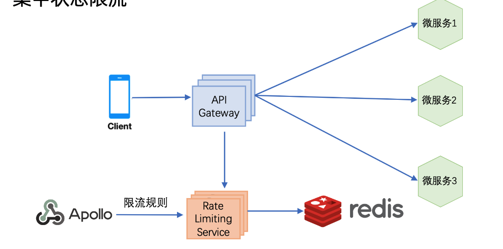
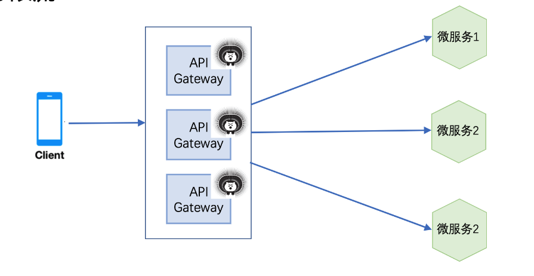
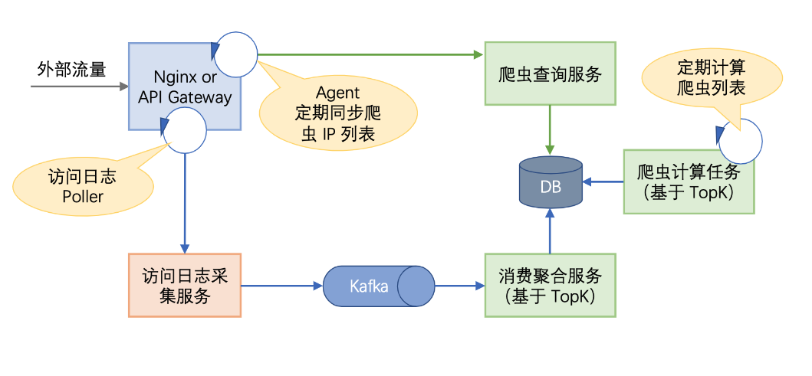

# Monitor system

<!-- MarkdownTOC -->

- [Rate limiter](#rate-limiter)
	- [Scenario](#scenario)
	- [Storage](#storage)
	- [Initial solution](#initial-solution)
	- [Final solution](#final-solution)
- [Data dog](#data-dog)
	- [Scenario](#scenario-1)
	- [Storage](#storage-1)
- [Health check](#health-check)
	- [Domain model](#domain-model)
	- [Architecture](#architecture)
	- [Delayed schedule queue](#delayed-schedule-queue)
		- [Check model](#check-model)
		- [Architecture](#architecture-1)
		- [Industrial implementationn](#industrial-implementationn)
	- [Distributed lock](#distributed-lock)
		- [Optimistic / Pessimistic lock](#optimistic--pessimistic-lock)
		- [Pessimistic lock - Fencing token](#pessimistic-lock---fencing-token)
		- [Industrial implementation](#industrial-implementation)
	- [Distributed rate limiting](#distributed-rate-limiting)
		- [Use case](#use-case)
		- [Deployment mode](#deployment-mode)
			- [Centralized](#centralized)
			- [Distributed](#distributed)
		- [Industrial implementation](#industrial-implementation-1)
	- [Top K system to prevent attack from crawler / DDos](#top-k-system-to-prevent-attack-from-crawler--ddos)

<!-- /MarkdownTOC -->

## Rate limiter
### Scenario
* Limit according to IP / UserId / Email
* If passing certain times / certain period, return 4XX error codes.
	- 2/s, 5/m, 10/h, 100d
	- Do not need too fine granularity

### Storage
* Need to log who did what at when
	- Event + feature + timestamp as memcached key
		+ event = url_shorten
		+ feature = 192.168.0.1
		+ timestamp
* Memcached
	- Fast
	- Do not need persistence

### Initial solution
* Algorithm
	- memcached.increment(key, ttl=60s)
	- Increment corresponding bucket, set invalid after 60s
* Check whether over the limits in the last minute

```
// Check the visiting sum in the last minute
for t in 0~59 do
	key = event + feature + (current_timestamp - t)
	sum += memcached.get(key, default=0)
```

### Final solution
* Multi-level bucket
	- Use 1 minute as a unit 
	- Use 1 day as a unit

## Data dog
### Scenario
* A user visiting a link is recorded as once visiting.
* Know the total number of visits.
* Can check the latest X day/month/years
* Typically a user always asks from a certain ts to current

### Storage
* NoSQL system
	- Need persistent storage
	- key is tinyUrl short_key, value is the visiting statistics
* Reduce 2K write QPS by aggregation: 
	- Need to aggregate the latest 15s visiting records together and then save in memory.
* Retention: Multi-level bucket
	- Use 1-minute as a unit
	- Use 5-minute as a unit
	- use 1-hour as a unit

## Health check
* Healthchecks.io
	- 120 paying customer
	- 1600 monthly recurring revenue
	- 10M pings per day
* Industrial implementation:
	- Sentry

### Domain model


### Architecture


### Delayed schedule queue
#### Check model
* Code
* Schedule
* Last_ping
* Alert_after
* Status

#### Architecture


#### Industrial implementationn
* db-scheduler / cron.io
* killbill notification queue
* Quartz (Java)
* Xxl-job (Java)
* Celery (Python)
* Hangfire (C#)

### Distributed lock
* Use case: Payment in SaaS platform

#### Optimistic / Pessimistic lock
#### Pessimistic lock - Fencing token


#### Industrial implementation
* ShedLock

### Distributed rate limiting
#### Use case
* Github API rate limiting
* Bitly API rate limiting
* LinkedIn rate limiting

#### Deployment mode
##### Centralized



##### Distributed




#### Industrial implementation
* Hystrix

### Top K system to prevent attack from crawler / DDos
* Use case: prevent attack from crawlers



