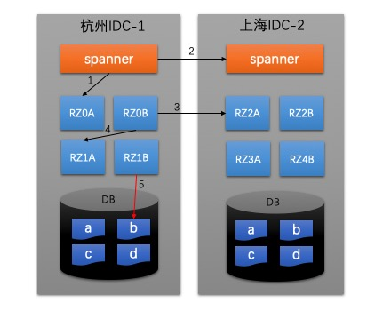
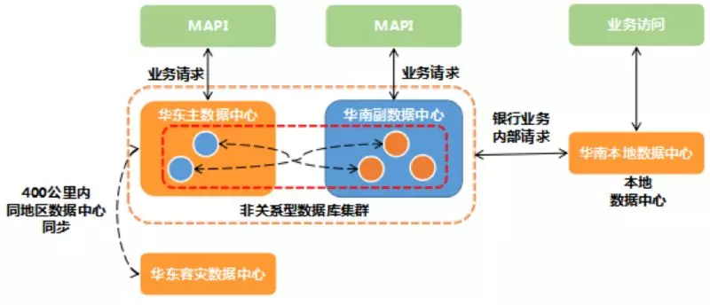
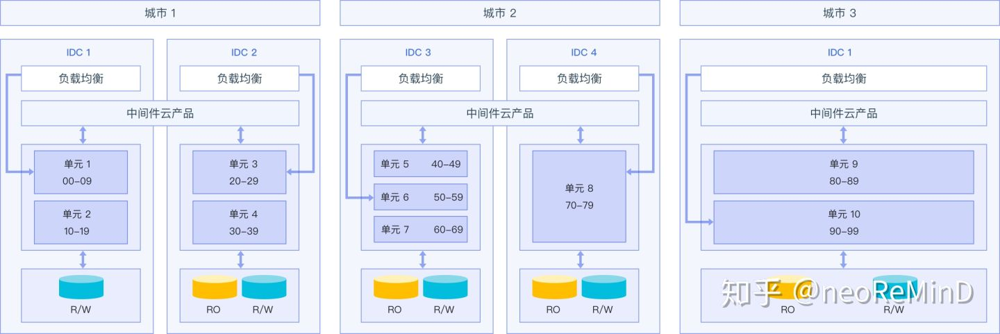
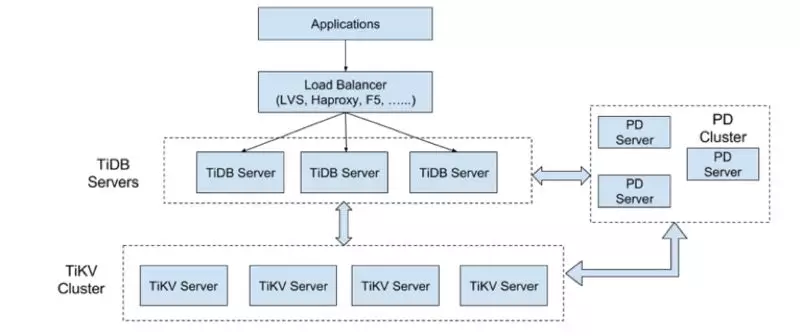
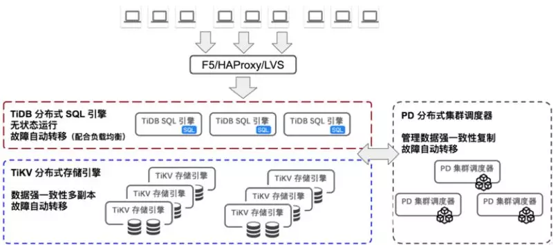
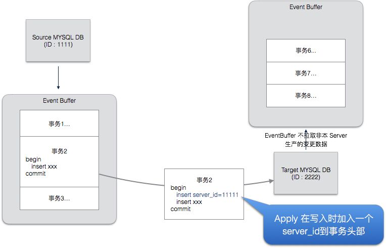
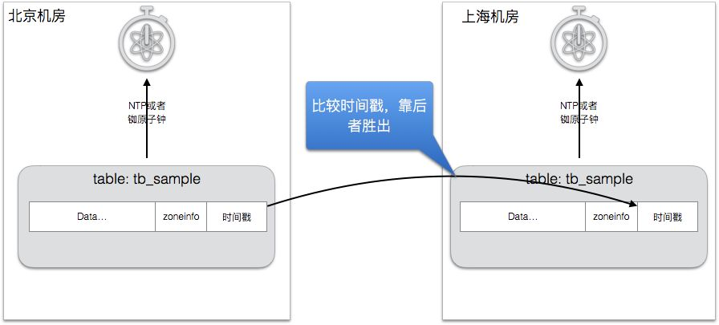
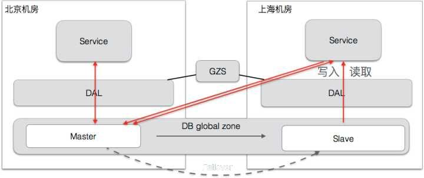

<!-- MarkdownTOC -->

- [Multi-DC](#multi-dc)
	- [Motivation](#motivation)
	- [Architecture revolution](#architecture-revolution)
		- [Disaster recovery with backup DCs](#disaster-recovery-with-backup-dcs)
		- [All active DCs with full copy of data](#all-active-dcs-with-full-copy-of-data)
			- [Differences between two DC patterns](#differences-between-two-dc-patterns)
			- [Architecture for two DCs within a city](#architecture-for-two-dcs-within-a-city)
			- [Architecture for two DCs within across city](#architecture-for-two-dcs-within-across-city)
		- [All active DCs with sharded data](#all-active-dcs-with-sharded-data)
	- [Synchronization](#synchronization)
	- [Typical architecture](#typical-architecture)
		- [Read intensive](#read-intensive)
		- [Read/write balanced](#readwrite-balanced)
		- [Change process](#change-process)
		- [Routing key](#routing-key)
			- [Failover process](#failover-process)
		- [Data synchronization](#data-synchronization)
			- [Cache synchronization](#cache-synchronization)
			- [MySQL data replication](#mysql-data-replication)
				- [DRC architecture](#drc-architecture)
				- [SCN](#scn)
			- [NoSQL data replication](#nosql-data-replication)
			- [NewSQL data replication](#newsql-data-replication)
				- [Oceanbase data replication](#oceanbase-data-replication)
				- [TiDB data replication](#tidb-data-replication)
				- [How to avoid circular replication](#how-to-avoid-circular-replication)
				- [How to recover from replication failure](#how-to-recover-from-replication-failure)
				- [How to avoid conflict](#how-to-avoid-conflict)
				- [How to avoid conflict](#how-to-avoid-conflict-1)
		- [Global zone service](#global-zone-service)
		- [Global eZone](#global-ezone)
	- [Multi DC in same city](#multi-dc-in-same-city)
		- [CRG Units](#crg-units)

<!-- /MarkdownTOC -->


# Multi-DC
## Motivation
* Improve availability
* Disaster recovery

## Architecture revolution
### Disaster recovery with backup DCs
* Definition:
	- Master DC1 in City A serves all traffic. Other DCs (DC1/DC2) are only for backup purpose. 
	- To be tolerant against failure in DC1. Deploy another backup DC 2 within the same city. 
	- To be tolerant against failure for entire city A. Deploy another backup DC 3 in city B. 
* Failover: 
	- If DC 1 goes down, fail over to DC 2.
	- If entire city A goes down, fail over to DC 3.
* Pros:
	- Improve availability. 
* Cons: 
	- Backup DC capacity is not used 100%.
	- No confidence that after failing over to backup DC, it could still serve traffic.

```
           ┌───────────────────────────────┐    ┌───────────────────────────────┐
           │            City A             │    │            City B             │
           │                               │    │                               │
           │                               │    │                               │
           │    ┌─────────────────────┐    │    │     ┌─────────────────────┐   │
           │    │                     │    │    │     │                     │   │
─read/write┼──▶ │     Master DC 1     │────backup────▶│     Backup DC 3     │   │
           │    │                     │    │    │     │                     │   │
           │    └─────────────────────┘    │    │     └─────────────────────┘   │
           │               │               │    │                               │
           │            backup             │    │                               │
           │               │               │    │                               │
           │               ▼               │    │                               │
           │    ┌─────────────────────┐    │    │                               │
           │    │                     │    │    │                               │
           │    │     Backup DC 2     │    │    │                               │
           │    │                     │    │    │                               │
           │    └─────────────────────┘    │    │                               │
           │                               │    │                               │
           └───────────────────────────────┘    └───────────────────────────────┘
```

### All active DCs with full copy of data
* Definition:
	- Master DCs serve read/write traffic. Slave DCs only serve read traffic. All master DCs have full copy of data. 
	- Slave DCs redirect write traffic to master DCs. 
* Failover: 
	- If DC 1 goes down, fail over to DC 2. 
	- If entire city A goes down, fail over to DC 3. 
* Pros:
	- Can be horizontally scaled to multiple DCs. 
* Cons:
	- Each DC needs to have full copy of data to be fault tolerant. 

```
           ┌───────────────────────────────┐    ┌───────────────────────────────┐           
           │            City A             │    │            City B             │           
           │                               │    │                               │           
           │                               │    │                               │           
           │    ┌─────────────────────┐    │    │     ┌─────────────────────┐   │           
           │    │                     │    │    │     │                     │   │           
─read/write┼──▶ │     Master DC 1     │◀───┼sync┼───▶ │     Master DC 3     │◀─read/write── 
           │    │                     │    │    │     │                     │   │           
           │    └─────────────────────┘    │    │     └─────────────────────┘   │           
           │               ▲               │    │                ▲              │           
           │               │               │    │                │              │           
           │           write to            │    │            write to           │           
           │            master             │    │             master            │           
           │               │               │    │                │              │           
           │               │               │    │                │              │           
           │    ┌─────────────────────┐    │    │     ┌─────────────────────┐   │           
           │    │                     │    │    │     │                     │   │           
─read/write┼─▶  │     Slave DC 2      │    │    │     │     Slave DC 4      │◀─read/write───
           │    │                     │    │    │     │                     │   │           
           │    └─────────────────────┘    │    │     └─────────────────────┘   │           
           │                               │    │                               │           
           └───────────────────────────────┘    └───────────────────────────────┘           
```

#### Differences between two DC patterns
* Typically the service latency should be smaller than 200ms. 

|   Pattern Name   |   Geographical distance      |  Round trip latency |              Example       | Num of cross DC calls  |
|------------------|------------------|---------------------|----------------------------|------------------------|
|    Close DC      | Within same city |      1ms-3ms        |  Two DCs within same city  | Smaller than a hundred |
|    Distant DC    | Across region    |      10ms-50ms      |  New York and Los Angeles  | Smaller than a couple  |
|    Distant DC    | Across continent |      100ms-200ms    |  Australia and USA.        | Avoid completely       |

* The following table summarizes the differences of these two pattern

|     Dimensions   |                 Close DC pattern                      |              Distant DC pattern                |
|------------------|-------------------------------------------------------|------------------------------------------------|
|    Definition    |  Two DCs are located close to each other geographically. For example, the two DCs are within the same city | Two DCs are located distant from each other geographically. For example, the two DCs are cross region (e.g. New York and Log Angeles), or even cross continent (e.g. USA and Australia) |
|        Cost      |  high (DC itself and dedicated line with same city)   |  extremely high (DC itself and dedicated line across same region/continent)   |
|     Complexity   |  Low. Fine to call across DCs due to low latency      |  High. Need to rearchitect due to high latency |
|  Service quality |  Increase latency a bit / increase availability       |  Decrease latency  / increase availability      |


#### Architecture for two DCs within a city
* 

```
┌───────────────────────────────────────────────┐     ┌────────────────────────────────────┐
│                      DC1                      │     │                DC2                 │
│                                               │     │                                    │
│      ┌─────────────────────────────────────┐  │     │    ┌─────────────────────────────┐ │
│      │                                     │  │     │    │                             │ │
│      │         Application Servers         │  │     │    │     Application Servers     │ │
│      │                                     │  │     │    │                             │ │
│      └─────────────────────────────────────┘  │     │    └─────────────────────────────┘ │
│                        │                      │     │                    │      │        │
│                        │                      │     │                    │      │        │
│                        │                      │     │                    │      │        │
│                        │                      │     │                    │      │        │
│                        │                      │     │                    │      │        │
│            ┌───read────┘           ┌──────────┼─────┼─────write──────────┘      │        │
│            │                       │          │     │                         read       │
│            │                       │          │     │                           │        │
│            │                       │          │     │                           │        │
│            │                       │          │     │                           │        │
│            │                       │          │     │                           │        │
│            ▼                       ▼          │     │                           ▼        │
│  ┌──────────────────┐    ┌──────────────────┐ │     │              ┌──────────────────┐  │
│  │    read slave    │    │   write master   │ │     │              │    read slave    │  │
│  │    components    │    │    components    │ │     │              │    components    │  │
│  │                  │    │                  │ │     │              │                  │  │
│  │                  │    │                  │ │     │              │                  │  │
│  │┌───────────┐     │    │  ┌───────────┐   │ │     │              │    ┌───────────┐ │  │
│  ││   Slave   │     │    │  │  Master   │   │ │     │              │    │  Service  │ │  │
│  ││  service  ◀─synchronize─┤  service  │ ──┼─┼─────synchronize────┼──▶ │ discovery │ │  │
│  ││ discovery │     │    │  │ discovery │   │ │     │              │    │           │ │  │
│  │└───────────┘     │    │  └───────────┘   │ │     │              │    └───────────┘ │  │
│  │                  │    │                  │ │     │              │                  │  │
│  │                  │    │                  │ │     │              │                  │  │
│  │                  │    │                  │ │     │              │                  │  │
│  │                  │    │                  │ │     │              │                  │  │
│  │                  │    │                  │ │     │              │                  │  │
│  │┌───────────┐     │    │  ┌───────────┐   │ │     │              │    ┌───────────┐ │  │
│  ││   Slave   │     │    │  │  Master   │   │ │     │              │    │           │ │  │
│  ││ Database ◀┼synchronize──┼─  Cache   │───┼─┼───synchronize──────┼──▶ │Slave Cache│ │  │
│  ││           │     │    │  │           │   │ │     │              │    │           │ │  │
│  │└───────────┘     │    │  └───────────┘   │ │     │              │    └───────────┘ │  │
│  │                  │    │         │        │ │     │              │                  │  │
│  │                  │    │         │        │ │     │              │                  │  │
│  │                  │    │         │        │ │     │              │                  │  │
│  │                  │    │         │        │ │     │              │                  │  │
│  │                  │    │         │        │ │     │              │                  │  │
│  │                  │    │         ▼        │ │     │              │                  │  │
│  │┌───────────┐     │    │   ┌───────────┐  │ │     │              │    ┌───────────┐ │  │
│  ││   Slave   │     │    │   │  Master   │  │ │     │              │    │   Slave   │ │  │
│  ││ Database  ◀─synchronize──│ Database  │──┼─┼───synchronize──────┼───▶│ Database  │ │  │
│  ││           │     │    │   │           │  │ │     │              │    │           │ │  │
│  │└───────────┘     │    │   └───────────┘  │ │     │              │    └───────────┘ │  │
│  │                  │    │                  │ │     │              │                  │  │
│  └──────────────────┘    └──────────────────┘ │     │              └──────────────────┘  │
│                                               │     │                                    │
│                                               │     │                                    │
└───────────────────────────────────────────────┘     └────────────────────────────────────┘
```

#### Architecture for two DCs within across city 

```
┌───────────────────────────────────────────────┐     ┌──────────────────────────────────────────────┐
│                      DC1                      │     │                     DC2                      │
│                                               │     │                                              │
│  ┌─────────────────────────────────────────┐  │     │ ┌─────────────────────────────────────────┐  │
│  │                                         │  │     │ │                                         │  │
│  │           Application Servers           │  │     │ │           Application Servers           │  │
│  │                                         │  │     │ │                                         │  │
│  └─────────────────────────────────────────┘  │     │ └─────────────────────────────────────────┘  │
│           │                     │             │     │                                │             │
│           │                     │             │     │             │                  │             │
│           │                     │             │     │             │                  │             │
│           │                     │             │     │             │                  │             │
│           │                     │             │     │             │                  │             │
│         read                 write            │     │             │               write            │
│           │                     │             │     │           read                 │             │
│           │                     │             │     │             │                  │             │
│           │                     │             │     │             │                  │             │
│           │                     │             │     │             │                  │             │
│           │                     │             │     │             │                  │             │
│           ▼                     ▼             │     │             ▼                  ▼             │
│  ┌────────────────┐  ┌────────────────┐       │     │     ┌───────────────┐   ┌──────────────────┐ │
│  │   read slave   │  │  write master  │       │     │     │ write master  │   │    read slave    │ │
│  │   components   │  │   components   │       │     │     │  components   │   │    components    │ │
│  │                │  │                │       │     │     │               │   │                  │ │
│  │                │  │                │  ┌────┴─────┴─┐   │               │   │                  │ │
│  │┌───────────┐   │  │ ┌───────────┐  │  │            │   │ ┌───────────┐ │   │  ┌───────────┐   │ │
│  ││   Slave   │   │  │ │  Master   │  │  │  message   │   │ │  Master   │ │   │  │   Slave   │   │ │
│  ││  service  ◀──sync┼─┼─ service  │◀─┼──┤ queue for ─┼───┼▶│  service ─┼─sync┼──▶  service  │   │ │
│  ││ discovery │   │  │ │ discovery │  │  │    sync    │   │ │ discovery │ │   │  │ discovery │   │ │
│  │└───────────┘   │  │ └───────────┘  │  │            │   │ └───────────┘ │   │  └───────────┘   │ │
│  │                │  │                │  │            │   │               │   │                  │ │
│  │                │  │                │  └────┬─────┬─┘   │               │   │                  │ │
│  │                │  │                │       │     │     │               │   │                  │ │
│  │                │  │                │       │     │     │               │   │                  │ │
│  │                │  │                │       │     │     │               │   │                  │ │
│  │┌───────────┐   │  │ ┌───────────┐  │       │     │     │ ┌───────────┐ │   │  ┌───────────┐   │ │
│  ││   Slave   │   │  │ │  Master   │  │      direct db    │ │  Master   │ │   │  │           │   │ │
│  ││ Database ◀┼─sync─┼─┤   Cache   │  │◀──────┼sync─┼────▶│ │ Database  ├─sync┼──▶Slave Cache│   │ │
│  ││           │   │  │ │           │  │       │     │     │ │           │ │   │  │           │   │ │
│  │└───────────┘   │  │ └───────────┘  │       │     │     │ └───────────┘ │   │  └───────────┘   │ │
│  │                │  │                │       │     │     │               │   │                  │ │
│  │                │  │                │       │     │     │               │   │                  │ │
│  │                │  │                │       │     │     │               │   │                  │ │
│  │                │  │                │       │     │     │               │   │                  │ │
│  │                │  │                │       │     │     │               │   │                  │ │
│  │                │  │                │       │     │     │               │   │                  │ │
│  │┌───────────┐   │  │ ┌───────────┐  │       │     │     │ ┌───────────┐ │   │   ┌───────────┐  │ │
│  ││   Slave   │   │  │ │  Master   │  │     direct db     │ │  Master   │ │   │   │   Slave   │  │ │
│  ││ Database  ◀─sync─┼─│ Database  │  ◀───────sync──┼────▶│ │ Database  │─┼sync──▶│ Database  │  │ │
│  ││           │   │  │ │           │  │       │     │     │ │           │ │   │   │           │  │ │
│  │└───────────┘   │  │ └───────────┘  │       │     │     │ └───────────┘ │   │   └───────────┘  │ │
│  │                │  │                │       │     │     │               │   │                  │ │
│  └────────────────┘  └────────────────┘       │     │     └───────────────┘   └──────────────────┘ │
│                                               │     │                                              │
│                                               │     │                                              │
└───────────────────────────────────────────────┘     └──────────────────────────────────────────────┘
```

### All active DCs with sharded data

```

```

## Synchronization

## Typical architecture


### Read intensive


### Read/write balanced


### Change process
1. Categorize the business
2. Categorize the data
3. Pick the correct synchronization mechanism
	* method1
4. Exception handling
	* method1

### Routing key


#### Failover process




### Data synchronization


#### Cache synchronization


#### MySQL data replication

##### DRC architecture


##### SCN


#### NoSQL data replication



#### NewSQL data replication

##### Oceanbase data replication



##### TiDB data replication







##### How to avoid circular replication



##### How to recover from replication failure


##### How to avoid conflict


##### How to avoid conflict



### Global zone service


### Global eZone 



## Multi DC in same city 

### CRG Units


* References:
	- 饿了吗：https://zhuanlan.zhihu.com/p/32009822
	- 异地多活架构： https://www.infoq.cn/video/PSpYkO6ygNb4tdmFGs0G
	- 微博异地多活：https://mp.weixin.qq.com/s?__biz=MzAwMDU1MTE1OQ==&mid=402920548&idx=1&sn=45cd62b84705fdd853bdd108b9301a17&3rd=MzA3MDU4NTYzMw==&scene=6#rd
	- Overview: https://www.modb.pro/db/12798
	- golden ant: 
		* https://www.infoq.cn/article/xYEWLWBSc1L9H4XvzGl0
		* https://static001.geekbang.org/con/33/pdf/1703863438/file/%E7%BB%88%E7%A8%BF-%E6%97%B6%E6%99%96-%E5%BC%82%E5%9C%B0%E5%A4%9A%E6%B4%BB%E5%8D%95%E5%85%83%E5%8C%96%E6%9E%B6%E6%9E%84%E4%B8%8B%E7%9A%84%E5%BE%AE%E6%9C%8D%E5%8A%A1%E4%BD%93%E7%B3%BB.pdf
	- 甜橙： https://mp.weixin.qq.com/s?__biz=MzIzNjUxMzk2NQ==&mid=2247489336&idx=1&sn=0a078591dbacda3e892d21ac0525de67&chksm=e8d7e8fadfa061eca5ff5b0c8f0035f7eec9abc6a6e8336a07cc2ea95ed0e9de1a8e3f19e508&scene=27#wechat_redirect
	- More: https://www.infoq.cn/article/kihSqp_twV16tiiPa1LO
	- https://s.geekbang.org/search/c=0/k=%E5%BC%82%E5%9C%B0%E5%A4%9A%E6%B4%BB/t=
	- 魅族：http://www.ttlsa.com/linux/meizu-mutil-loaction-soul/
	- 迁移角度：https://melonshell.github.io/2020/01/24/tech3_multi_room_living/
	- 李运华：https://time.geekbang.org/column/article/12408
	- 唐杨：https://time.geekbang.org/column/article/171115
	- 微服务多机房：https://time.geekbang.org/column/article/64301
	- 缓存多机房：https://time.geekbang.org/course/detail/100051101-253459
	- Google Ads 异地多活的高可用架构：https://zhuanlan.zhihu.com/p/103391944
	- TiDB: https://docs.pingcap.com/zh/tidb/dev/multi-data-centers-in-one-city-deployment
	- 支付宝架构：https://www.hi-linux.com/posts/39305.html#1-%E8%83%8C%E6%99%AF
	- 三地五中心：https://www.jianshu.com/p/aff048130bed