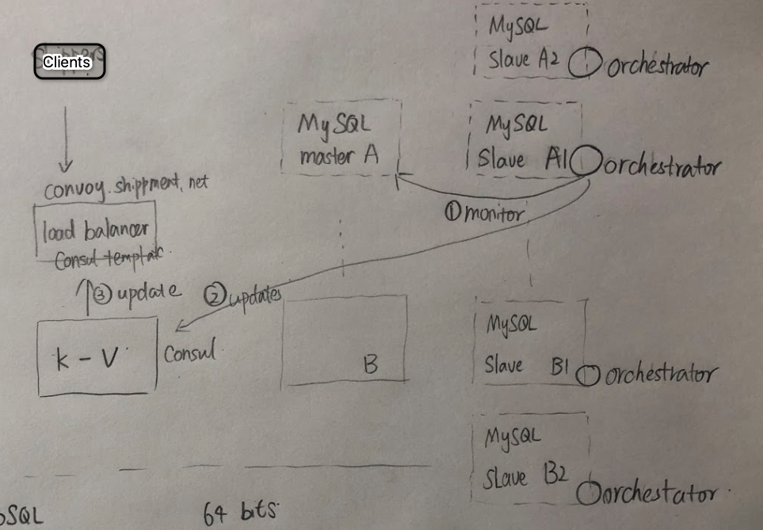
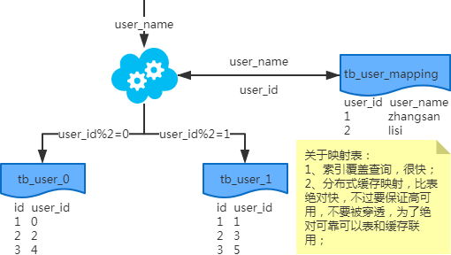
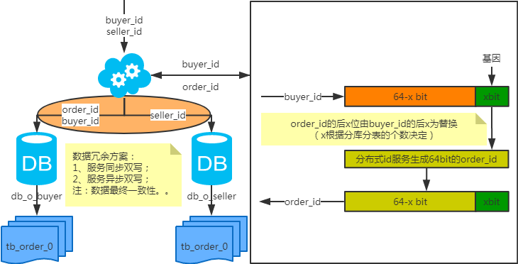
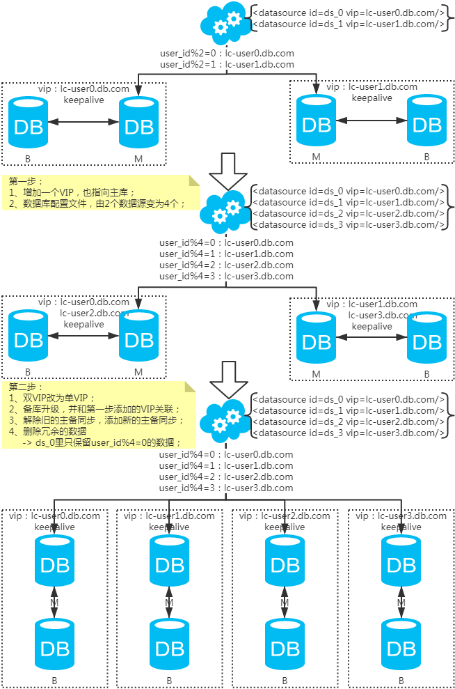
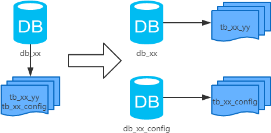

<!-- MarkdownTOC -->

- [MySQL](#mysql)
	- [High availability basics](#high-availability-basics)
		- [Master slave delay](#master-slave-delay)
			- [Sources](#sources)
				- [Inferior slave machines](#inferior-slave-machines)
				- [Too much load for slave](#too-much-load-for-slave)
				- [Big transactions](#big-transactions)
				- [Slow slave thread replay](#slow-slave-thread-replay)
					- [Paralelle approaches](#paralelle-approaches)
			- [How to find sync points](#how-to-find-sync-points)
				- [sql_slave_skip_counter](#sql_slave_skip_counter)
				- [slave_skip_errors](#slave_skip_errors)
				- [GTID](#gtid)
		- [Failover strategy](#failover-strategy)
			- [Reliability first](#reliability-first)
			- [Availability first](#availability-first)
				- [Inconsistency when binlog format = raw](#inconsistency-when-binlog-format--raw)
				- [Inconsistency when binlog format = mixed](#inconsistency-when-binlog-format--mixed)
	- [Typical architectures](#typical-architectures)
		- [Dual master](#dual-master)
			- [Asynchronous replication](#asynchronous-replication)
			- [Semi-Synchronous replication](#semi-synchronous-replication)
			- [Group replication](#group-replication)
		- [MMM \(Multi-master replication manager\)](#mmm-multi-master-replication-manager)
		- [MHA \(Master high availability\)](#mha-master-high-availability)
		- [Github/WePay MySQL high availability](#githubwepay-mysql-high-availability)
			- [Master discovery series](#master-discovery-series)
		- [Other solutions](#other-solutions)
			- [MySQL cluster](#mysql-cluster)
			- [Galera](#galera)
			- [PAXOS](#paxos)
			- [Shared storage such as Amazon Aurora](#shared-storage-such-as-amazon-aurora)
	- [Sharding](#sharding)
		- [Choose between table and database sharding](#choose-between-table-and-database-sharding)
		- [Choose the number of shards](#choose-the-number-of-shards)
		- [Choose the sharding key](#choose-the-sharding-key)
			- [Query on single nonpartition key](#query-on-single-nonpartition-key)
				- [Scenario](#scenario)
				- [Mapping based approach](#mapping-based-approach)
				- [Gene based approach](#gene-based-approach)
			- [Scale out](#scale-out)
			- [Database](#database)
			- [Table](#table)
		- [Sharding categories](#sharding-categories)
			- [Table sharding](#table-sharding)
				- [Use case](#use-case)
				- [Vertical sharding](#vertical-sharding)
				- [Horizontal sharding](#horizontal-sharding)
			- [Database sharding](#database-sharding)
				- [Use case](#use-case-1)
				- [Vertical sharding](#vertical-sharding-1)
				- [Horizontal sharding](#horizontal-sharding-1)
		- [Sharding Limitations](#sharding-limitations)
			- [Distributed transaction](#distributed-transaction)
			- [Cross shard joins](#cross-shard-joins)
			- [Unique global key](#unique-global-key)
				- [UUID](#uuid)
				- [Redis](#redis)
				- [Twitter](#twitter)
				- [Industrial approach](#industrial-approach)
			- [Reshard](#reshard)
- [Future readings](#future-readings)

<!-- /MarkdownTOC -->


# MySQL

## High availability basics
### Master slave delay
#### Sources
* The master-slave latency is defined as the difference between T3 and T1. 
	1. Master DB executes a transaction, writes into binlog and finishes at timestamp T1.
	2. The statement is replicated to binlog, Slave DB received it from the binlog T2.
	3. Slave DB executes the transaction and finishes at timestamp T3. 

##### Inferior slave machines
* Slave machine is insuperior to master

##### Too much load for slave
* Causes: Many analytical queries run on top of slave. 
* Solutions:
	- Multiple slaves
	- Output telemetry to external statistical systems such as Hadoop through binlog 

##### Big transactions
* If a transaction needs to run for as long as 10 minutes on the master database, then it must wait for the transaction to finish before running it on slave. Slave will be behind master for 10 minutes. 
	- e.g. Use del to delete too many records within DB
	- e.g. mySQL DDL within big tables. 

##### Slow slave thread replay


###### Paralelle approaches
* DB based parallel
* Table/Row based parallel
* History
	- MySQL 5.5
	- MySQL 5.6
	- MySQL 5.7
	- MySQL 5.7.22


#### How to find sync points
##### sql_slave_skip_counter
##### slave_skip_errors
##### GTID

### Failover strategy
#### Reliability first
* After step 2 and before step4 below, both master and slave will be in readonly state. 

```
                  │     │         ┌──────────────────────┐                          
                  │     │         │Step5. Switch traffic │                          
                  │     │         │     from A to B      │                          
                  │     │         └──────────────────────┘                          
                 Requests                                                           
                  │     │                                                           
                  │     │                                                           
                  │     │                                                           
                  ▼     ▼                                                           
                                                                                    
┌────────────────────────────┐                         ┌───────────────────────────┐
│          Master A          │                         │         Master B          │
│ ┌───────────────────────┐  │                         │ ┌───────────────────────┐ │
│ │step2. Change master to│  │                         │ │step1. check           │ │
│ │readonly state         │  │                         │ │seconds_behind_master  │ │
│ └───────────────────────┘  │                         │ │until it is smaller    │ │
│                            │                         │ │than 5 seconds         │ │
│                            │                         │ └───────────────────────┘ │
│                            │                         │ ┌───────────────────────┐ │
│                            │                         │ │step3. wait until      │ │
│                            │                         │ │seconds_behind_master  │ │
│                            │                         │ │to become 0            │ │
└────────────────────────────┘                         │ │                       │ │
                                                       │ └───────────────────────┘ │
                                                       │ ┌───────────────────────┐ │
                                                       │ │step4. change to       │ │
                                                       │ │read/write state       │ │
                                                       │ │instead of readonly    │ │
                                                       │ │                       │ │
                                                       │ └───────────────────────┘ │
                                                       │                           │
                                                       │                           │
                                                       └───────────────────────────┘
```

#### Availability first
* It may result in data inconsistency. Using row format binlog will makes identify data inconsistency problems much easier than mixed or statement based binlog. 

```
                  │     │         ┌──────────────────────┐                          
                  │     │         │Step3. Switch traffic │                          
                  │     │         │     from A to B      │                          
                  │     │         └──────────────────────┘                          
                 Requests                                                           
                  │     │                                                           
                  │     │                                                           
                  │     │                                                           
                  ▼     ▼                                                           
                                                                                    
┌────────────────────────────┐                         ┌───────────────────────────┐
│          Master A          │                         │         Master B          │
│ ┌───────────────────────┐  │                         │                           │
│ │step2. Change master to│  │                         │ ┌───────────────────────┐ │
│ │readonly state         │  │                         │ │step1. change to       │ │
│ └───────────────────────┘  │                         │ │read/write state       │ │
│                            │                         │ │instead of readonly    │ │
│                            │                         │ │                       │ │
│                            │                         │ └───────────────────────┘ │
│                            │                         │                           │
│                            │                         │                           │
│                            │                         │                           │
└────────────────────────────┘                         └───────────────────────────┘
```

##### Inconsistency when binlog format = raw
* [TODO]: understand deeper


##### Inconsistency when binlog format = mixed


## Typical architectures
* [Standards to select mysql ha solutions](https://www.mysqlha.com/)

```
1. Local Failure handling (Local HA) – Can you recover quickly and automatically from DBMS and host failures?
2. Global Failure handling (Disaster Recovery) – Can you recover quickly and in an automated fashion on full site failures?
3. Zero-down Time Maintenance – Can you upgrade hardware, software, and data without taking applications offline?
4. Load Balancing – Can you effectively split reads to slaves and writes to master, and can you automatically load balance the reads to multiple slaves?
5. Performance – Does the HA/DR solution also improve the overall database performance?
6. Transparency – Can you deploy the HA solution without making changes to applications or migrating data?
7. Multi-Site Operations – Can you handle data spread over multiple data centers using both multi-master as well as primary/backup models?
8. Cloud Readiness – Can you run easily in cloud environments like Amazon Web Services, Google Cloud, or OpenStack?
9. Hardware Utilization – Does the HA/DR solution increase application throughput and hardware utilization through active replicas?
10. Readiness for Business-Critical Use– Does the HA/DR solution have management and monitoring tools, QA, and 24/7 support with very fast response times for business-critical use? What about the HA/DR solutions maturity and number of production deployments?
```

### Dual master
#### Asynchronous replication
#### Semi-Synchronous replication
#### Group replication


### MMM (Multi-master replication manager)
* [MMM](https://mysql-mmm.org/downloads.html) is a set of scripts written in perl providing the following capabilities:
	- Load balancing among read slaves
	- Master failover
	- Monitor mySQL states
* Pros:
	- Easy config
* Cons:
	- Not suitable for scenarios having high requirements on data consistency
* Deployment: Although dual master, only allows writing to a single master at a time.
	- mmm_mond: Coordinator scripts. Run on top of a monitoring machine
		+ Create a set of virtual IPs. One write IP binds to the master and multiple read IPs bind to slave. 
		+ When a mySQL is down, it will migrate the VIP to another mySQL machine. 
	- mmm_agentd: Run on the same machine as the mysql server
	- mmm_control: Provides administrative commands for mmm_mond

### MHA (Master high availability)
* [MHA](https://github.com/yoshinorim/mha4mysql-manager/wiki/Architecture)
	- Fast failover: Complete the failover within 0-30 seconds
	- Max effort consistency: When a master goes down, it will try to save binlog in the failed master. It uses this way to keep the maximum data consistency. However, this isn't reliable way. For example, some hardware failures may result in failure of saving binlogs. 
	- Compared with MMM, 
		+ Supports devops work like health check, suspend nodes
		+ Supports semi-synchronous, GTID 
* Deployment: 
	- MHA manager could be deployed in a separate machine for managing several master-slave clusters. It could also be deployed on a single slave. 
	- MHA node runs on each mysql server. 
* Cons:
	- Needs at minimum 3 machines
	- Brain split
	- Not suitable for scenarios having high requirements on data consistency

### Github/WePay MySQL high availability
* [Used at Wepay](https://wecode.wepay.com/posts/highly-available-mysql-clusters-at-wepay)
* [Used at Github](
https://github.blog/2018-06-20-mysql-high-availability-at-github/)



#### Master discovery series
1. DNS http://code.openark.org/blog/mysql/mysql-master-discovery-methods-part-1-dns
2. VPN and DNS
http://code.openark.org/blog/mysql/mysql-master-discovery-methods-part-2-vip-dns
3. app and service discovery
http://code.openark.org/blog/mysql/mysql-master-discovery-methods-part-3-app-service-discovery
4. Proxy heuristics
http://code.openark.org/blog/mysql/mysql-master-discovery-methods-part-4-proxy-heuristics
5. Service discovery and Proxy
http://code.openark.org/blog/mysql/mysql-master-discovery-methods-part-5-service-discovery-proxy
6. http://code.openark.org/blog/mysql/mysql-master-discovery-methods-part-6-other-methods

### Other solutions
#### MySQL cluster
#### Galera
#### PAXOS
#### Shared storage such as Amazon Aurora

## Sharding
### Choose between table and database sharding
* We could classify the layout within database into the following categories:
	- Single database single table
	- Single database multiple table
	- Multiple database multiple table
* The preference order is as follows:
	1. Single database single table
	2. If data volume is big, could consider single database multiple table. 
		- Could use 50M rows as the standard size for a single table. 
		- The MyISAM storage engine supports 2^32 rows per table.The InnoDB storage engine doesn't seem to have a limit on the number of rows, but it has a limit on table size of 64 terabytes. How many rows fits into this depends on the size of each row.
	3. If concurrent volume is high, then could consider using multiple database multiple table. 
		- For example, test MySQL 5.7 on a 4 Core 8 GB cloud server
			- Write performance: 500 TPS 
			- Also note down here the read performance for reference: 10000 QPS

### Choose the number of shards
* If has a cap on storage:
	- Each shard could contain at most 1TB data.
	- number of shards = total storage / 1TB
* If has a cap on number of records:
	- Suppose the size of row is 100 bytes
		- User table: uid (long 8 bytes), name (fixed char 16 bytes), city (int 4 bytes), timestamp (long 8 bytes), sex (int 4 bytes), age (int 4 bytes) = total 40 bytes
	- Total size of the rows: 100 bytes * Number_of_records
	- number of shards = total size of rows / 1TB

### Choose the sharding key
* How to partition the application data.
	- What tables should be split
	- What tables should be available on all shards
	- What columns are the data to be sharded on 
* What sharding metadata (information about shards) you need and how to manage it. 
	- How to allocate shards to MySQL servers
	- How to map sharding keys to shards
	- What you need to store in the sharding database
* How to handle the query dispatch
	- How to get the sharding key necessary to direct queries and transactions to the right shard
* Create a scheme for shard management
	- How to monitor the load on the shards
	- How to move shards
	- How to rebalance the system by splitting and merging shards.
* If a non-integer value is chosen to be used a sharding key, for the ease of sharding, a hashing (e.g. CRC32) could be performed. 
* Typical sharding key
	- City
		+ How to handle uneven distribution problem
	- Timestamp
		+ Uneven distribution
	- Unique user idenitifer

#### Query on single nonpartition key
##### Scenario
* First, it could depend on the query pattern. If it is a OLAP scenario, it could be done offline as a batch job. If it is a OLTP scenario, it should be done in a much more efficient way. 

##### Mapping based approach
* Query the mapping table first for nonpartition key => partition key
* The mapping table could be covered by index



##### Gene based approach
* Number of gene bits: Depend on the number of sharding tables
* Process:
	1. When querying with user name, generate user_name_code as the first step
	2. intercept the last k gene bits from user_name_code




#### Scale out
* https://www.cnblogs.com/littlecharacter/p/9342129.html

#### Database



#### Table


### Sharding categories
#### Table sharding
##### Use case
* Single table too big: There are too many lines in a single table. Each query scans too many rows and the efficiency is really low.

##### Vertical sharding
* Operations:
	+ Put different **fields of a table** into different tables
	+ Segmented tables usually share the primary key for correlating data


##### Horizontal sharding
* Operations:
	+ Based on certain fields, put **rows of a table** into different tables. 


#### Database sharding
##### Use case
* Disk IO: There are too many hot data to fit into database memory. Each time a query is executed, there are a lot of IO operations being generated which reduce performance. 
* Network IO: Too many concurrent requests. 

##### Vertical sharding
+ Based on certain fields, put **tables of a database** into different database. 
+ Each database will share the same structure. 



##### Horizontal sharding
+ Put different **tables** into different databases
+ There is no intersection between these different tables 
+ As the stepping stone for micro services

### Sharding Limitations
#### Distributed transaction
* Original transaction needs to be conducted within a distributed transaction.
	- e.g. ecommerce example (order table and inventory table)
* There are wwo ways in general to implement distributed transactions:
	- 2PC 
	- TCC
* For example, some software has built-in implementations such as:
	- MySQL XA
	- Spring JTA

#### Cross shard joins
* Usually needed when creating reports. 
	- Execute the query in a map-reduce fashion. 
	- Replicate all the shards to a separate reporting server and run the query. 
* To resolve the problem, we could
	- Replicate it in another table

#### Unique global key
##### UUID
##### Redis
##### Twitter
##### Industrial approach
* Generate a unique UUID
	- UUID takes 128 bit. 
* Use a composite key
	- The first part is the shard identifier (see “Mapping the Sharding Key” on page 206)
	- The second part is a locally generated identifier (which can be generated using AUTO_INCREMENT). 
	- Note that the shard identifier is used when generating the key, so if a row with this identifier is moved, the original shard identifier has to move with it. You can solve this by maintaining, in addition to the column with the AUTO_INCREMENT, an extra column containing the shard identifier for the shard where the row was created.

#### Reshard
* Use 2's multiply number as table's number or database's number.


# Future readings
* MySQL DDL as big transaction
* Sharding Proxy - 百度DB Proxy ??? 
