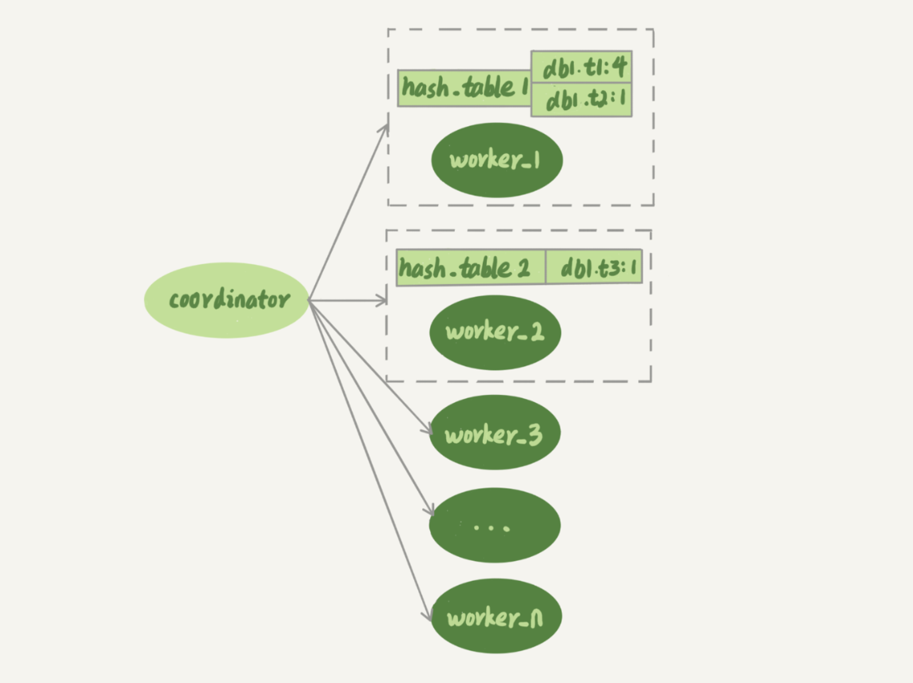

<!-- MarkdownTOC -->

- [MySQL](#mysql)
	- [High availability](#high-availability)
		- [Sources for master slave delay](#sources-for-master-slave-delay)
			- [Inferior slave machines](#inferior-slave-machines)
			- [Too much load for slave](#too-much-load-for-slave)
			- [Big transactions](#big-transactions)
			- [Parallel slave replication](#parallel-slave-replication)
				- [Approaches](#approaches)
					- [DB based parallel](#db-based-parallel)
					- [Table/Row based parallel](#tablerow-based-parallel)
				- [History](#history)
					- [MySQL 5.5](#mysql-55)
					- [MySQL 5.6](#mysql-56)
					- [MySQL 5.7](#mysql-57)
					- [MySQL 5.7.22](#mysql-5722)
		- [Dual master](#dual-master)
			- [Failover strategy](#failover-strategy)
				- [Reliability first](#reliability-first)
				- [Availability first](#availability-first)
					- [Inconsistency when binlog format = raw](#inconsistency-when-binlog-format--raw)
					- [Inconsistency when binlog format = mixed](#inconsistency-when-binlog-format--mixed)
- [Future readings](#future-readings)

<!-- /MarkdownTOC -->


# MySQL

## High availability
### Sources for master slave delay
* The master-slave latency is defined as the difference between T3 and T1. 
	1. Master DB executes a transaction, writes into binlog and finishes at timestamp T1.
	2. The statement is replicated to binlog, Slave DB received it from the binlog T2.
	3. Slave DB executes the transaction and finishes at timestamp T3. 

#### Inferior slave machines
* Slave machine is insuperior to master

#### Too much load for slave
* Causes: Many analytical queries run on top of slave. 
* Solutions:
	- Multiple slaves
	- Output telemetry to external statistical systems such as Hadoop through binlog 

#### Big transactions
* If a transaction needs to run for as long as 10 minutes on the master database, then it must wait for the transaction to finish before running it on slave. Slave will be behind master for 10 minutes. 
	- e.g. Use del to delete too many records within DB
	- e.g. mySQL DDL within big tables. 

#### Parallel slave replication


##### Approaches
###### DB based parallel
###### Table/Row based parallel
##### History
###### MySQL 5.5
###### MySQL 5.6
###### MySQL 5.7
###### MySQL 5.7.22




### Dual master

```
//flowchart

```

#### Failover strategy
##### Reliability first
* After step 2 and before step4 below, both master and slave will be in readonly state. 

```
                  │     │         ┌──────────────────────┐                          
                  │     │         │Step5. Switch traffic │                          
                  │     │         │     from A to B      │                          
                  │     │         └──────────────────────┘                          
                 Requests                                                           
                  │     │                                                           
                  │     │                                                           
                  │     │                                                           
                  ▼     ▼                                                           
                                                                                    
┌────────────────────────────┐                         ┌───────────────────────────┐
│          Master A          │                         │         Master B          │
│ ┌───────────────────────┐  │                         │ ┌───────────────────────┐ │
│ │step2. Change master to│  │                         │ │step1. check           │ │
│ │readonly state         │  │                         │ │seconds_behind_master  │ │
│ └───────────────────────┘  │                         │ │until it is smaller    │ │
│                            │                         │ │than 5 seconds         │ │
│                            │                         │ └───────────────────────┘ │
│                            │                         │ ┌───────────────────────┐ │
│                            │                         │ │step3. wait until      │ │
│                            │                         │ │seconds_behind_master  │ │
│                            │                         │ │to become 0            │ │
└────────────────────────────┘                         │ │                       │ │
                                                       │ └───────────────────────┘ │
                                                       │ ┌───────────────────────┐ │
                                                       │ │step4. change to       │ │
                                                       │ │read/write state       │ │
                                                       │ │instead of readonly    │ │
                                                       │ │                       │ │
                                                       │ └───────────────────────┘ │
                                                       │                           │
                                                       │                           │
                                                       └───────────────────────────┘
```

##### Availability first
* It may result in data inconsistency. Using row format binlog will makes identify data inconsistency problems much easier than mixed or statement based binlog. 

```
                  │     │         ┌──────────────────────┐                          
                  │     │         │Step3. Switch traffic │                          
                  │     │         │     from A to B      │                          
                  │     │         └──────────────────────┘                          
                 Requests                                                           
                  │     │                                                           
                  │     │                                                           
                  │     │                                                           
                  ▼     ▼                                                           
                                                                                    
┌────────────────────────────┐                         ┌───────────────────────────┐
│          Master A          │                         │         Master B          │
│ ┌───────────────────────┐  │                         │                           │
│ │step2. Change master to│  │                         │ ┌───────────────────────┐ │
│ │readonly state         │  │                         │ │step1. change to       │ │
│ └───────────────────────┘  │                         │ │read/write state       │ │
│                            │                         │ │instead of readonly    │ │
│                            │                         │ │                       │ │
│                            │                         │ └───────────────────────┘ │
│                            │                         │                           │
│                            │                         │                           │
│                            │                         │                           │
└────────────────────────────┘                         └───────────────────────────┘
```

###### Inconsistency when binlog format = raw
* [TODO]: understand deeper


###### Inconsistency when binlog format = mixed


# Future readings
* MySQL DDL as big transaction