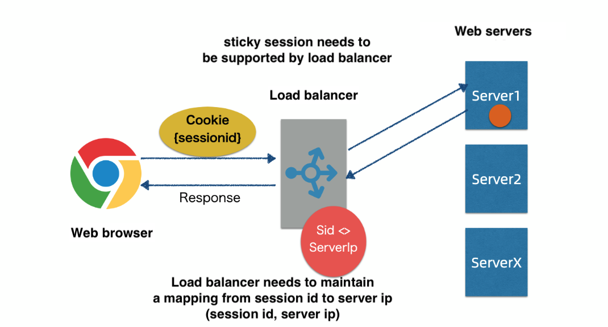

<!-- MarkdownTOC -->

- [Security:](#security)
	- [Auth architecture revolution](#auth-architecture-revolution)
		- [Single server cookie based auth](#single-server-cookie-based-auth)
		- [Multi server sticky session based auth](#multi-server-sticky-session-based-auth)
		- [Auth Service and token](#auth-service-and-token)
		- [Gateway and token](#gateway-and-token)
		- [Gateway and JWT](#gateway-and-jwt)
			- [HMAC JWT](#hmac-jwt)
			- [RSA JWT](#rsa-jwt)
	- [OAuth2](#oauth2)

<!-- /MarkdownTOC -->

# Security:
## Auth architecture revolution
### Single server cookie based auth

### Multi server sticky session based auth
* Cons:
	- Sticky session binds a session to a server. If the server goes down or needs to be maintained. 
	- Sticky session needs to store session data in load balancer. 
* Possible solutions:
	1. Session synchronization by replicating across web servers
	2. Store session data completely inside users' browser
		- Cons: Limited size of cookie
	3. Store session data in a shared storage

### Auth Service and token
* Pros:
	- Encapsulate everything related with token issuing
	- Introduce the concept of token, which could be passed around between services
* Cons:
	- Services need to implement the logic to validate the token. 
	- All services need to talk to authSvc, which might become a performance bottleneck. 	
	- All requests need to be verified via auth service. 

### Gateway and token
* Pros:
	- Gateway centralizes the logic of parsing userInfo. Only gateway need to validate the token with auth service. 
* Cons:
	- All requests need to be verified via auth service. Auth service needs to be maintained and scaled in a manageable way. 

### Gateway and JWT
* Pros:
	- Compact and lightweight
	- Low pressure on Auth server
	- Simplify the implementation of auth server
* Cons:
	- Could not invalidate a JWT token if it has been leaked
	- JWT might become big

#### HMAC JWT

#### RSA JWT

## OAuth2

* OpenID Connect: Authentication layer
	- id_token: 
* OAuth2: Authorization layer
	- Simlplest guide: https://medium.com/@darutk/the-simplest-guide-to-oauth-2-0-8c71bd9a15bb
	- Definition: https://time.geekbang.org/course/detail/100007001-6936
	- Typical modes: https://time.geekbang.org/course/detail/100007001-6937
		- Ruanyifeng overview: http://www.ruanyifeng.com/blog/2014/05/oauth_2_0.html
		- Authorization code based approach
		- implicit approach： 
		- resource owner credentials approach:
		- client credentials approach:
	- How to refresh token: 
	- Categorize OAuth2 mode
		- based on channel / client type / 
* Type of access token:
	- By reference token
	- By value token: JWT token
* Next generation of security architecture:
	- Typical architecture: https://time.geekbang.org/course/detail/100007001-7511
		+ Approach 1:
		+ Approach 2: 
		+ Approach 3: 	